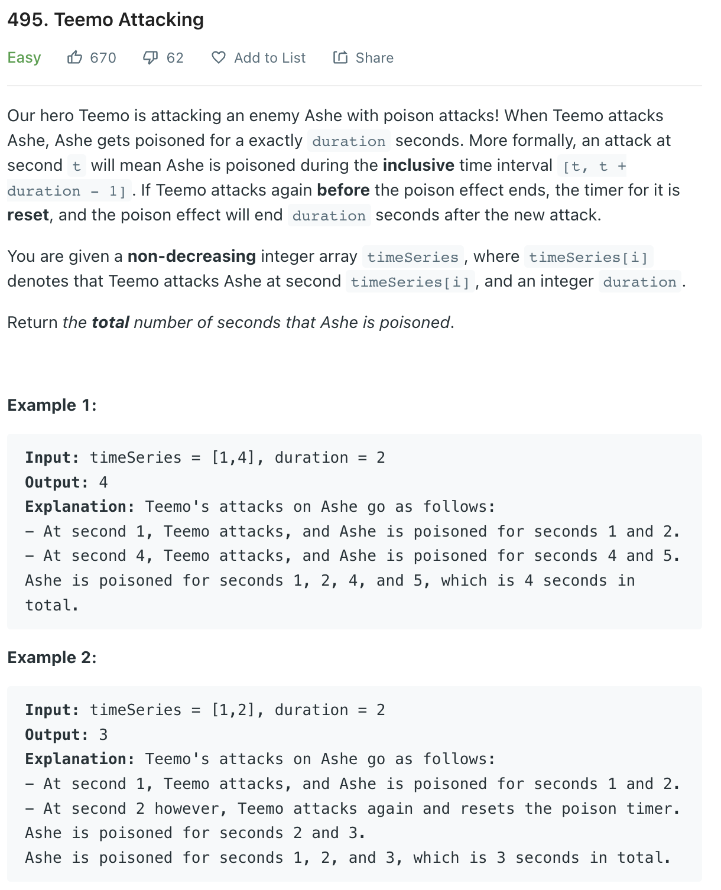

___
[495. Teemo Attacking](https://leetcode.com/problems/teemo-attacking/)
___

## 分析问题
* 

## 基本思路
* 

___

`Time complexity : O(n)`

`Space complexity : O(1)`
```python
class Solution:
    def findPoisonedDuration(self, timeSeries: List[int], duration: int) -> int:
        answer = 0
        for i in range(len(timeSeries) - 1):
            answer += min(timeSeries[i + 1] - timeSeries[i], duration)
            
        return answer + duration
```