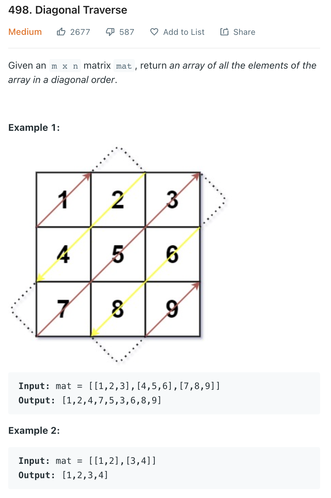
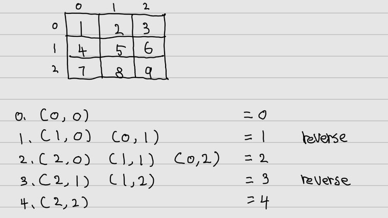

___
[498. Diagonal Traverse](https://leetcode.com/problems/diagonal-traverse/)
___


## 基本思路
* There is a pure logic way to solve this question, it take constant space.
* But that's to hard to understand.
* I have a easy way, find the pattern
* The sum of indexRow and indexCol of a diagonal are the same.
* 
* If we have a HashMap, the key is the sum of indexRow and indexCol, the value is a list.
* We can easily find the solution

___

`Time complexity : O(M * N)`

`Space complexity : O(M * N)`
```python
class Solution:
    def findDiagonalOrder(self, mat: List[List[int]]) -> List[int]:
        m = len(mat)
        n = len(mat[0])
        store = [[] for _ in range(m + n - 1)]

        for i in range(m):
            for j in range(n):
                store[i + j].append(mat[i][j])
        
        answer = [] 
        
        for index, values in enumerate(store):
            if index % 2 == 0:
                [answer.append(x) for x in values[::-1]]
            else:
                [answer.append(x) for x in values]
        
        return answer
        
```