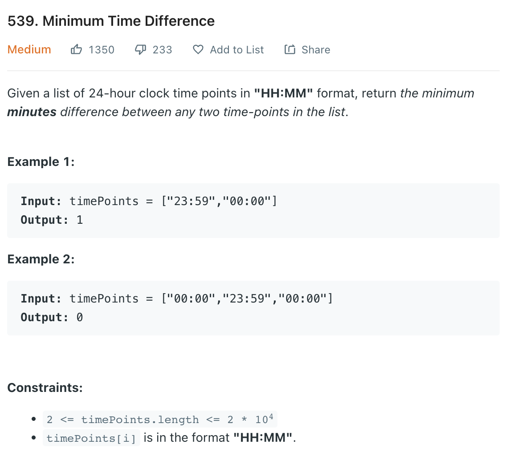

___
[539. Minimum Time Difference](https://leetcode.com/problems/minimum-time-difference/)
___


## 基本思路
* First, this is a normal question.
* We convert each time to minutes from 00:00
* For example, 23:59 is 1439, 00:00 is 1440
* Then sort the minutes in an increasing order.
* The tricky part is ['23:59', '00:01'].
* The answer should be 2 instead of 1438.
* How to we find the real minutes difference?
* `answer = timePoints[0] + 1440 - timePoints[-1]`
* Since the first element is the smallest, and last element is largest.

___

`Time complexity : O(nlog(n))`

`Space complexity : O(1)`
```python
class Solution:
    def findMinDifference(self, timePoints: List[str]) -> int:
        for i, time in enumerate(timePoints):
            hours, minutes = time.split(":")
            timePoints[i] = int(hours) * 60 + int(minutes)
        timePoints.sort()
        
        answer = timePoints[0] + 1440 - timePoints[-1]
        
        for i in range(1, len(timePoints)):
            answer = min(answer, timePoints[i] - timePoints[i - 1])
        return answer
```