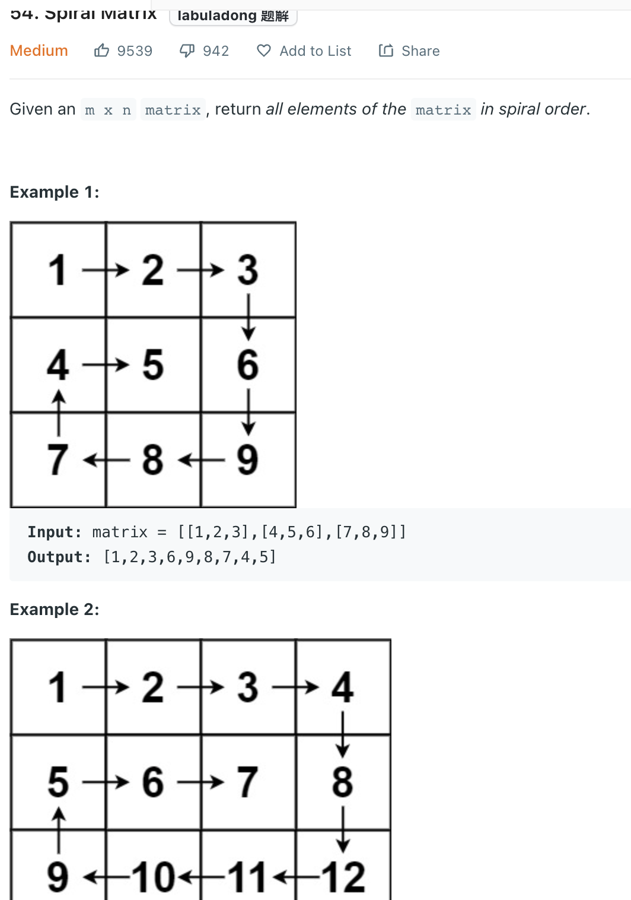

___
[54. Spiral Matrix](https://leetcode.com/problems/spiral-matrix/)
___

## 基本思路
* This is a pure logic question.
* Be sure don't go over same row and col twice

___

`Time complexity : O(M * N)`

`Space complexity : O(1)`
```python
class Solution:
    def spiralOrder(self, matrix: List[List[int]]) -> List[int]:
        startRow, endRow, startCol, endCol = 0, len(matrix) - 1, 0, len(matrix[0]) - 1
        answer = []

        while startRow <= endRow and startCol <= endCol:

            # left -> right
            for i in range(startCol, endCol + 1):
                answer.append(matrix[startRow][i])
            
            # top -> bottom
            for i in range(startRow + 1, endRow + 1):
                answer.append(matrix[i][endCol])
                
            # right -> left
            if startRow != endRow:
                for i in range(endCol - 1, startCol - 1, -1):
                    answer.append(matrix[endRow][i])
            
            # bottom -> top
            if startCol != endCol:
                for i in range(endRow - 1, startRow, -1):
                    answer.append(matrix[i][startCol])
                
            startRow += 1
            endRow -= 1
            startCol += 1
            endCol -= 1
            
        return answer
```