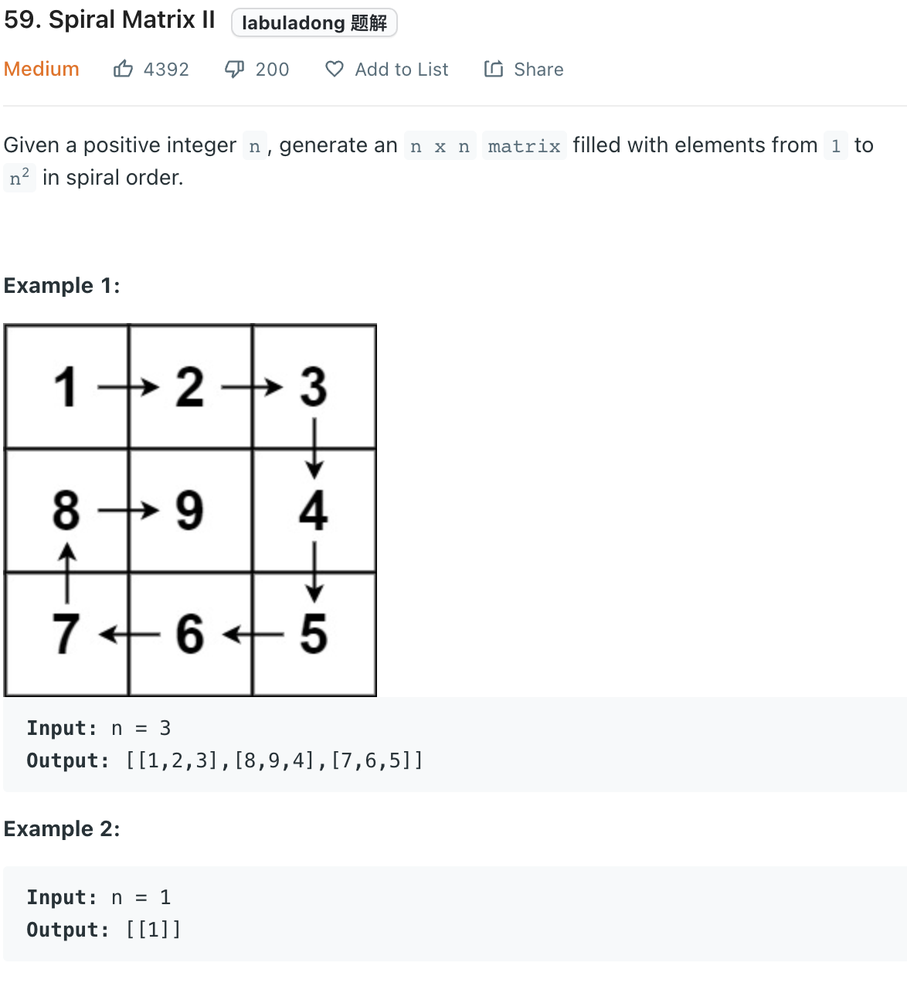

___
[59. Spiral Matrix II](https://leetcode.com/problems/spiral-matrix-ii/)
___

## 基本思路
* 

___

`Time complexity : O(n^2)`

`Space complexity : O(n^2)`
```python
class Solution:
    def generateMatrix(self, n: int) -> List[List[int]]:
        matrix = [[0 for _ in range(n)] for _ in range(n)]
        num = 1
        rowStart = colStart = 0
        rowEnd = colEnd = n
        
        while rowStart <= rowEnd and colStart <= colEnd:
            
            #Left -> Right
            for i in range(colStart, colEnd):
                matrix[rowStart][i] = num
                num += 1
            rowStart += 1
            
            #Top -> Down
            for i in range(rowStart, rowEnd):
                matrix[i][colEnd - 1] = num
                num += 1   
            colEnd -= 1
            
            #Right -> Left
            for i in range(colEnd - 1, colStart -1, -1):
                matrix[rowEnd - 1][i] = num
                num += 1
            rowEnd -= 1
            
            #Down -> Top
            for i in range(rowEnd - 1, rowStart - 1, -1):
                matrix[i][colStart] = num
                num += 1
            colStart += 1
                
        return matrix
```