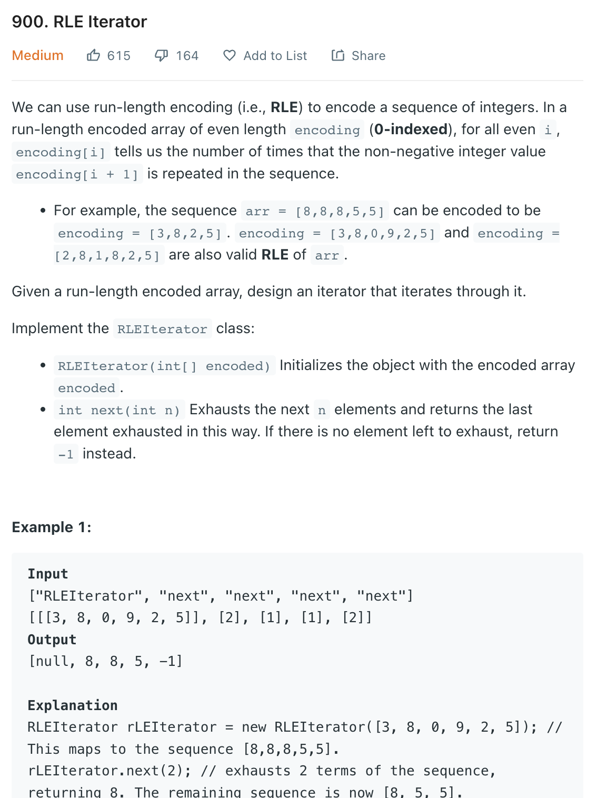

___
[900. RLE Iterator](https://leetcode.com/problems/rle-iterator/)
___

## 基本思路
* This is a greedy question

___

`Time complexity : O(n)`

`Space complexity : O(n)`
```python
class RLEIterator:

    def __init__(self, encoding: List[int]):
        self.encoding = encoding
        self.index = 0

    def next(self, n: int) -> int:
        while self.index < len(self.encoding):
            if n > self.encoding[self.index]:
                n -= self.encoding[self.index]
                self.index += 2
            else:
                self.encoding[self.index] -= n
                return self.encoding[self.index + 1]
        return -1
```