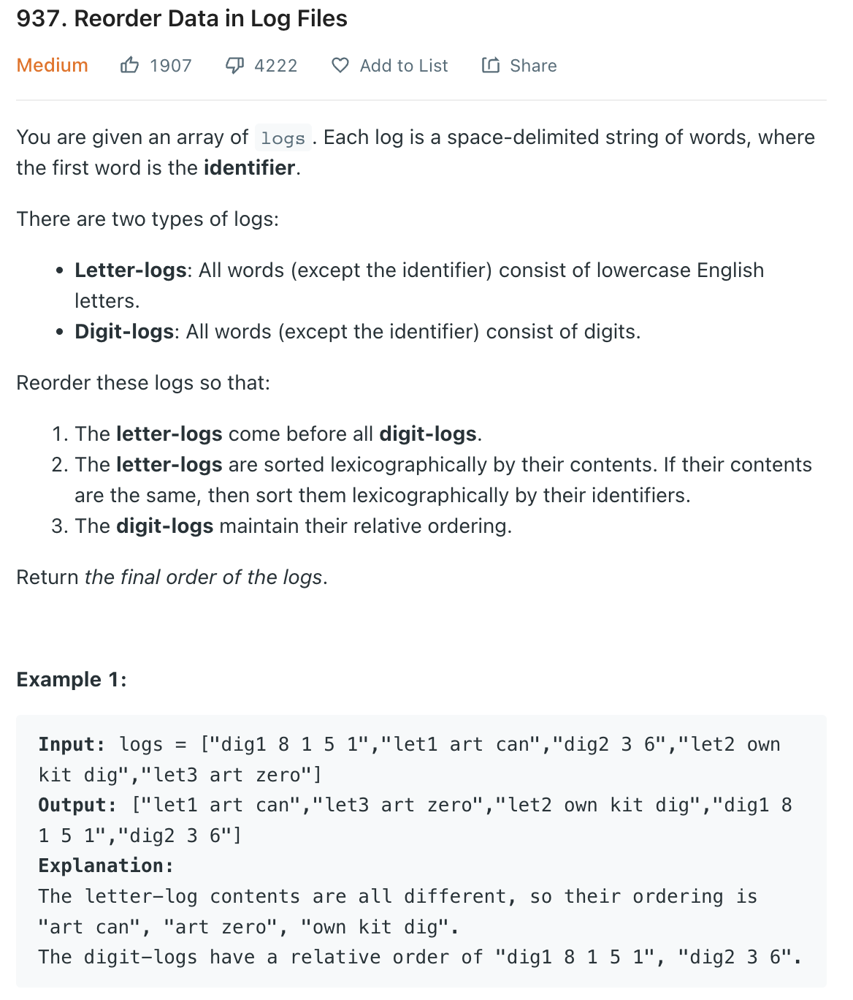

___
[937. Reorder Data in Log Files](https://leetcode.com/problems/reorder-data-in-log-files/)
___


## 基本思路
* Write a Comparator.
* Divide String into two by split ' '
* `dig1 8 1 5 1`
* `split[0] = dig1`
* `split[1] = 8 1 5 1`
* If both `split[1].charAt(0)` are digit, do nothing.
* Letter come first.
* If both are letter
* If both split[1] are equal then compare split[0]

___

`Time complexity : O()`

`Space complexity : O()`
```java
class Solution {
    public String[] reorderLogFiles(String[] logs) {
        String[] ss = logs[0].split(" ", 2);
        for (String s: ss) {
            System.out.println(s);
        }
        
        Comparator<String> com = new Comparator<String>() {
            @Override
            public int compare(String s1, String s2) {
                String[] split1 = s1.split(" ", 2);
                String[] split2 = s2.split(" ", 2);

                boolean isDigit1 = Character.isDigit(split1[1].charAt(0));
                boolean isDigit2 = Character.isDigit(split2[1].charAt(0));

                if(!isDigit1 && !isDigit2) {
                    // both letter-logs. 
                    int comp = split1[1].compareTo(split2[1]);
                    if (comp == 0) return split1[0].compareTo(split2[0]);
                    else return comp;
                } else if (isDigit1 && isDigit2) {
                    // both digit-logs. So keep them in original order
                    return 0; 
                } else if (isDigit1 && !isDigit2) {
                    // first is digit, second is letter. bring letter to forward.
                    return 1;
                } else {
                    //first is letter, second is digit. keep them in this order.
                    return -1; 
                }
            }
        };
        Arrays.sort(logs, com);
        return logs;
    }
}
```