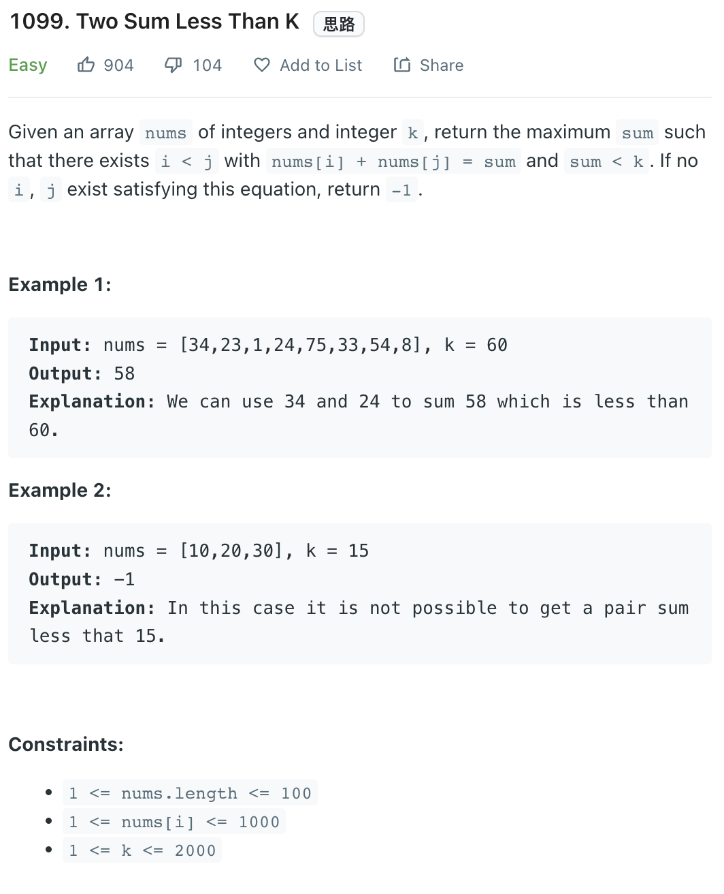

___
[1099. Two Sum Less Than K](https://leetcode.com/problems/two-sum-less-than-k/)
___


## 基本思路
* Sort then Binary Search

___

`Time complexity : O(nlogn)`

`Space complexity : O(1)`
```python
class Solution:
    def twoSumLessThanK(self, nums: List[int], k: int) -> int:
        nums.sort()
        left, right = 0, len(nums) - 1
        answer = -1
        while left < right:
            num_sum = nums[left] + nums[right]
            if num_sum < k:
                answer = max(answer, num_sum)
                left += 1
            else:
                right -= 1
        
        return answer
```