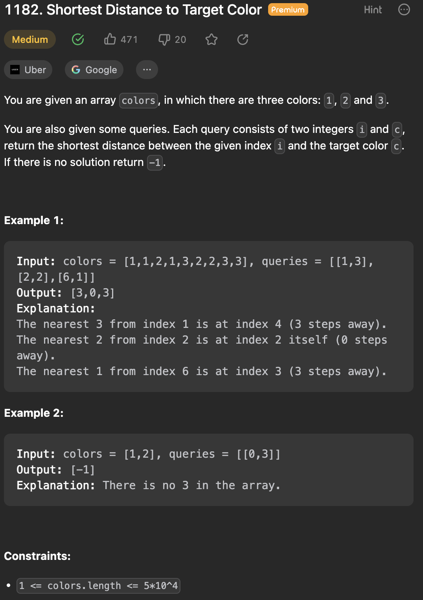
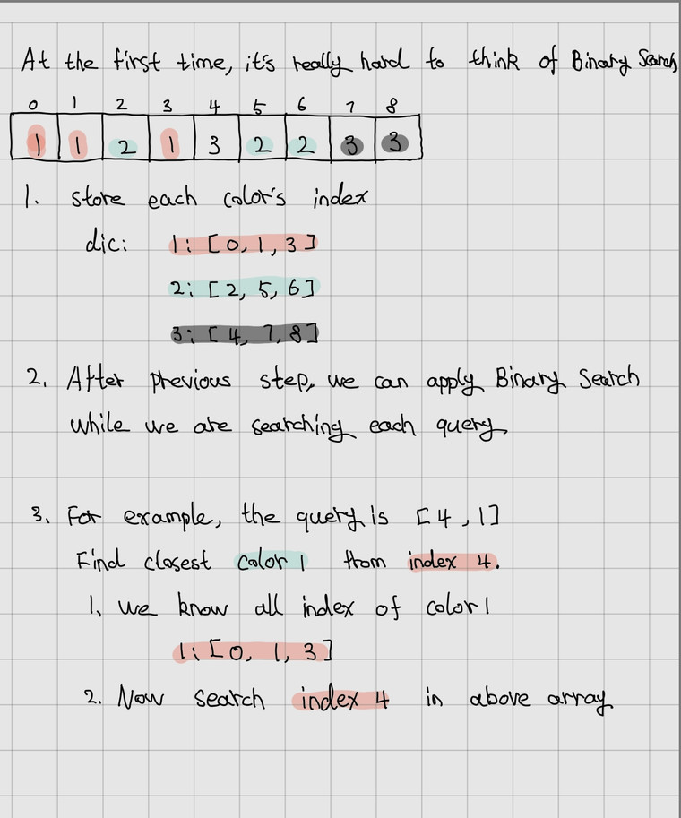

___
[1182. Shortest Distance to Target Color](https://leetcode.com/problems/shortest-distance-to-target-color/)
___


## 基本思路
* 

___

`Time complexity : O(nlog(m))`

`Space complexity : O(n)`
```python
class Solution:
    def shortestDistanceColor(self, colors: List[int], queries: List[List[int]]) -> List[int]:
        dic = defaultdict(list)
        for index, color in enumerate(colors):
            dic[color].append(index)
        
        answer = []

        for index, color in queries:
            if color not in dic:
                answer.append(-1)
            else:
                answer.append(self.binarySearch(index, dic[color]))

        return answer
    
    def binarySearch(self, index, nums):
        left, right = 0, len(nums) - 1
        minDistance = float('inf')
        
        while left <= right:
            mid = left + (right - left) // 2
            minDistance = min(minDistance, abs(nums[mid] - index))
            if nums[mid] >= index:
                right = mid - 1
            else:
                left = mid + 1

        return minDistance
```