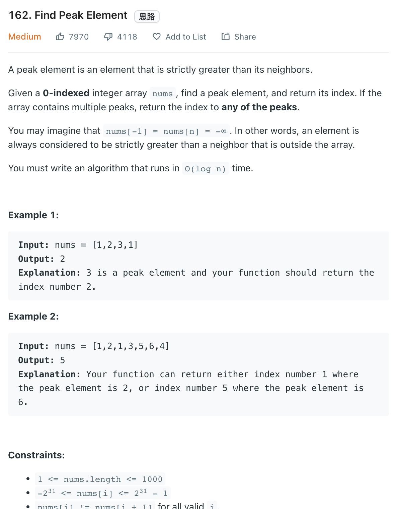
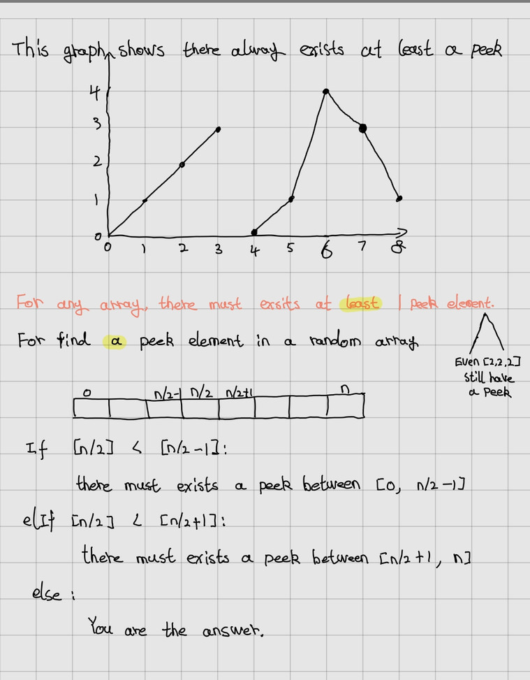

___
[162. Find Peak Element](https://leetcode.com/problems/find-peak-element/)
___


## 基本思路


___

`Time complexity : O(log(n))`

`Space complexity : O(1)`
```python
class Solution:
    def findPeakElement(self, nums: List[int]) -> int:
        left, right = 0, len(nums) - 1
        
        while left + 1 < right:
            mid = (left + right) // 2
            if nums[mid] >= nums[mid + 1]:
                right = mid
            else:
                left = mid
     
        return left if nums[left] > nums[right] else right
```