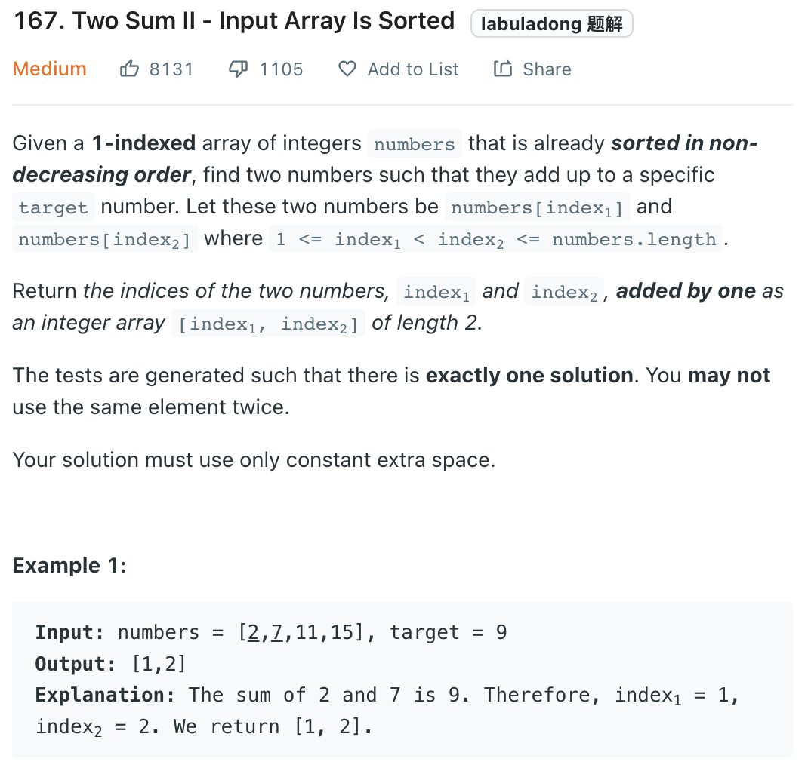

___
[167. Two Sum II - Input Array Is Sorted](https://leetcode.com/problems/two-sum-ii-input-array-is-sorted/)
___


## 基本思路
* Since the array is sorted
* We do a two pointer (binary search)
* if sum of left and right is smaller than target, we do left + 1 (increase sum for next round)

___

`Time complexity : O(n)`

`Space complexity : O(1)`
```python
class Solution:
    def twoSum(self, numbers: List[int], target: int) -> List[int]:
        left, right = 0, len(numbers) - 1
        
        while left <= right:
            num_sum = numbers[left] + numbers[right]
            if num_sum == target:
                return [left + 1, right + 1]
            
            if num_sum < target:
                left += 1
            else:
                right -= 1
                
        return [-1, -1]
```