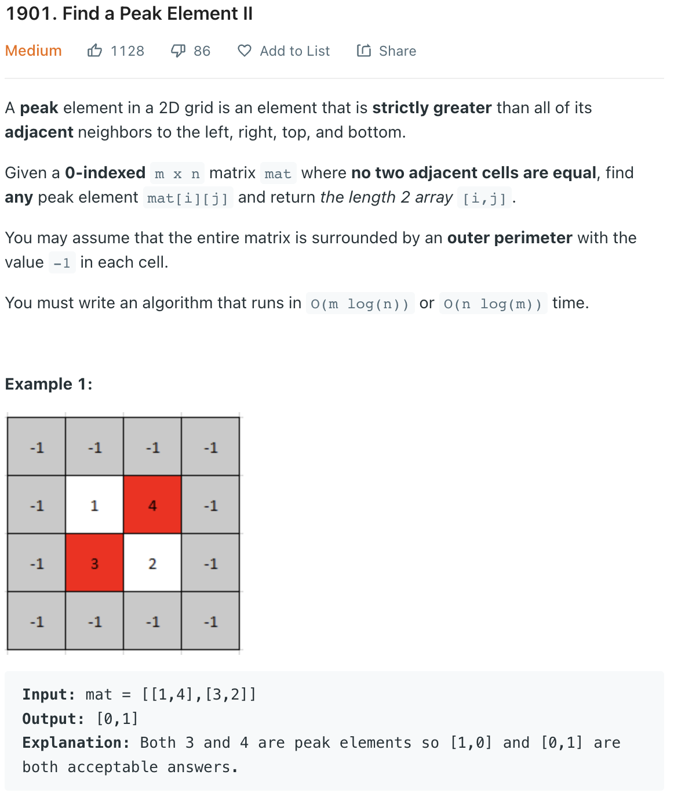
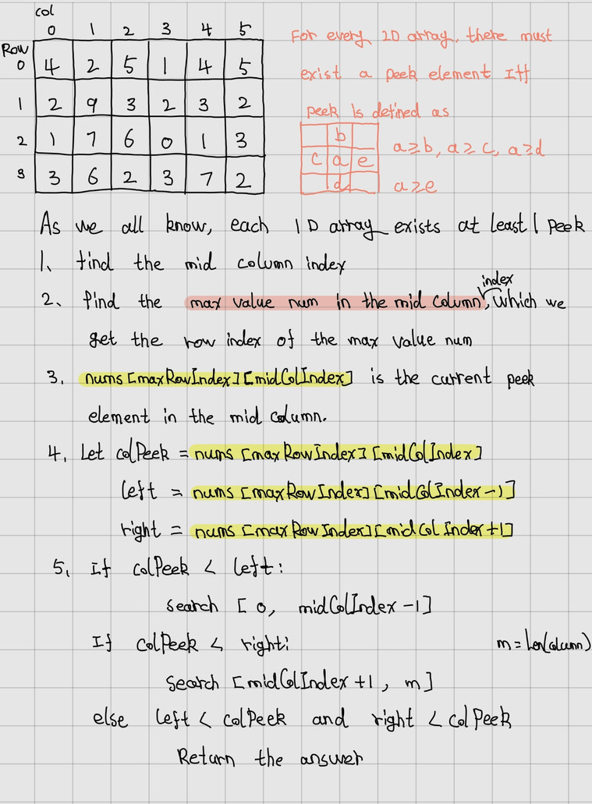
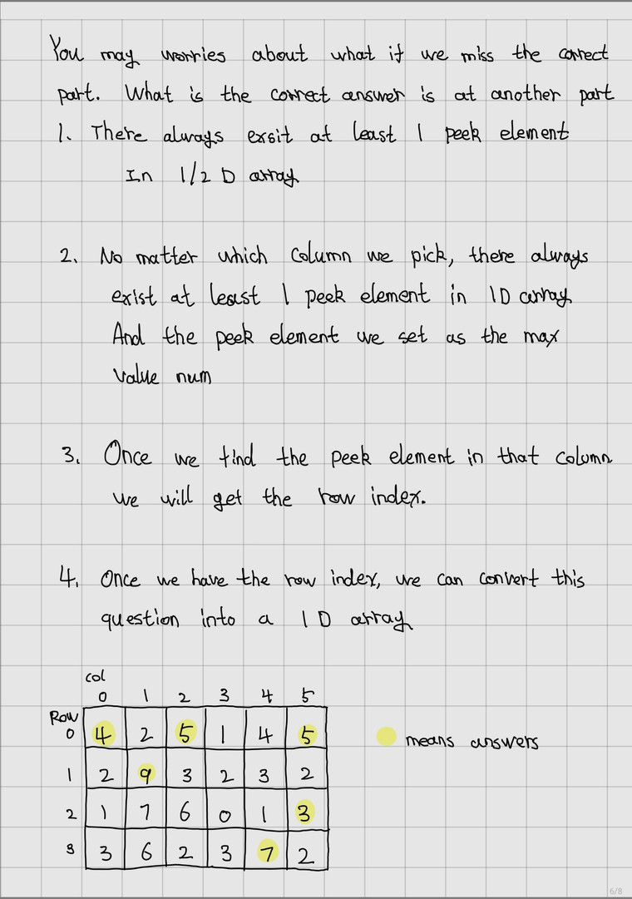
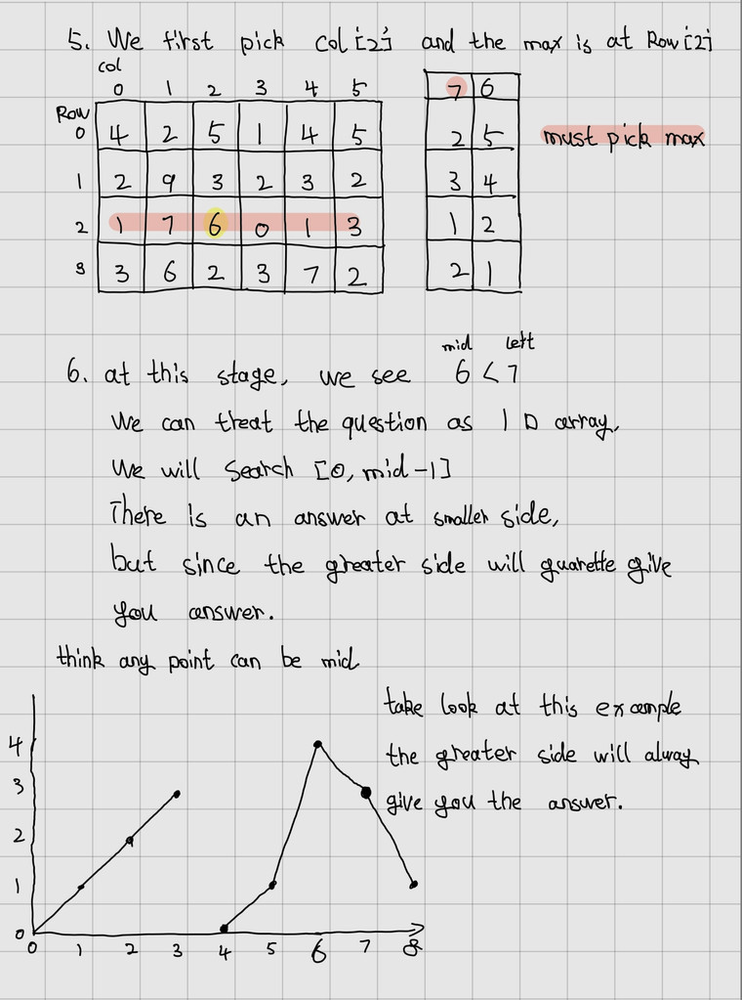
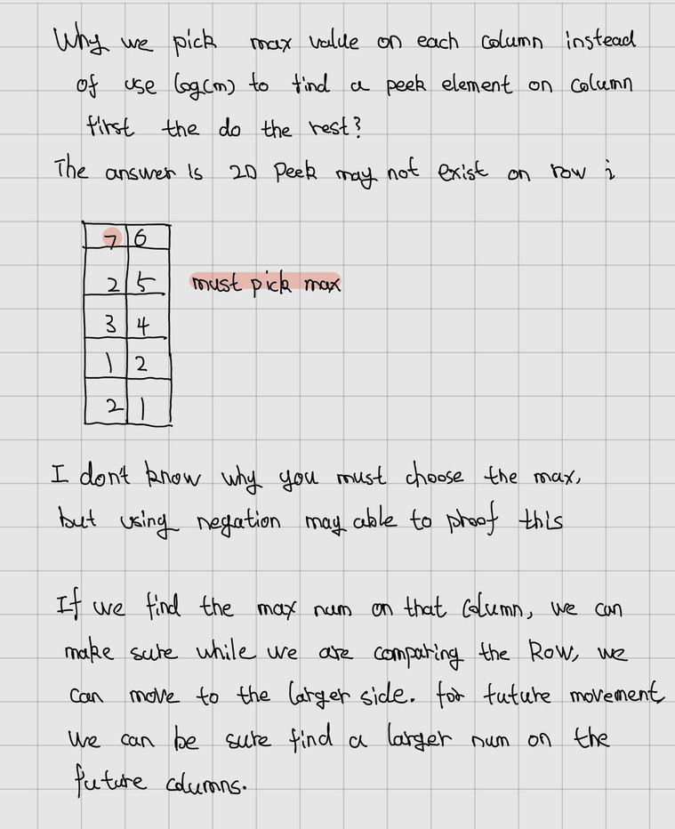

___
[1901. Find a Peak Element II](https://leetcode.com/problems/find-a-peak-element-ii/)
___


## 基本思路
* 
* 
* 
* 

___

`Time complexity : O(mlog(n))`

`Space complexity : O(1)`
```python
class Solution:
    def findPeakGrid(self, mat: List[List[int]]) -> List[int]:
        rowLength, colLength = len(mat), len(mat[0]) - 1
        left, right = 0, colLength
        
        while left <= right:
            colMidIndex = left + (right - left) // 2
            
            maxRowIndex = 0
            for i in range(rowLength):
                if mat[maxRowIndex][colMidIndex] < mat[i][colMidIndex]:
                    maxRowIndex = i
            
            colPeekElement = mat[maxRowIndex][colMidIndex]
            leftElement = mat[maxRowIndex][colMidIndex - 1] if colMidIndex > 0 else -1
            rightElement = mat[maxRowIndex][colMidIndex + 1] if colMidIndex < colLength else -1
            
            if leftElement < colPeekElement and rightElement < colPeekElement:
                return [maxRowIndex, colMidIndex]
            elif colPeekElement < leftElement:
                right = colMidIndex - 1
            else:
                left = colMidIndex + 1
            
                
```