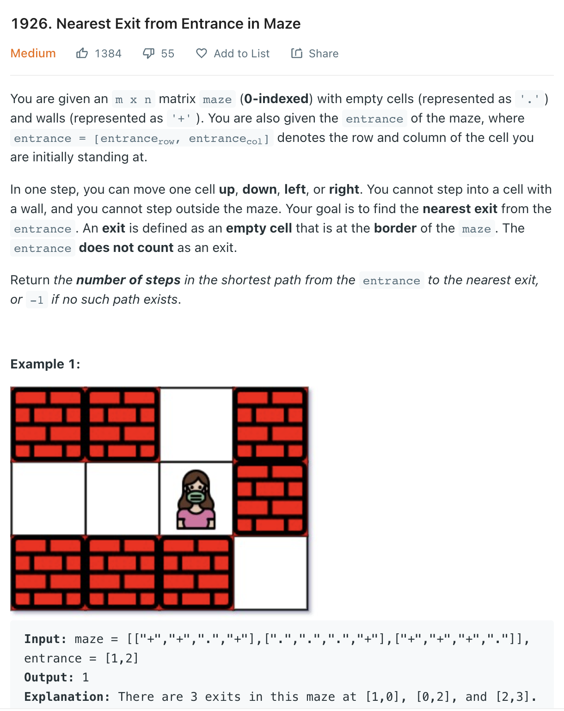

___
[1926. Nearest Exit from Entrance in Maze](https://leetcode.com/problems/nearest-exit-from-entrance-in-maze/)
___


## 基本思路
* Normal BFS

___

`Time complexity : O(n^2)`

`Space complexity : O(n^2)`
```python
class Solution:
    def nearestExit(self, maze: List[List[str]], entrance: List[int]) -> int:
        rowLength, colLength = len(maze), len(maze[0])
        
        maze[entrance[0]][entrance[1]] = '+'
        queue = collections.deque()
        
        queue.append((entrance[0], entrance[1]))
        
        steps = 0
        while queue:
            steps += 1
            for _ in range(len(queue)):
                row, col = queue.popleft()
                for x, y in [(row + 1, col), (row - 1, col), (row, col + 1), (row, col - 1)]:
                    if 0 <= x < rowLength and 0 <= y < colLength and maze[x][y] == '.':
                        if x == 0 or x == rowLength - 1 or y == 0 or y == colLength - 1:
                            return steps
                        queue.append((x, y))
                        maze[x][y] = '+'
                        
        return -1
```