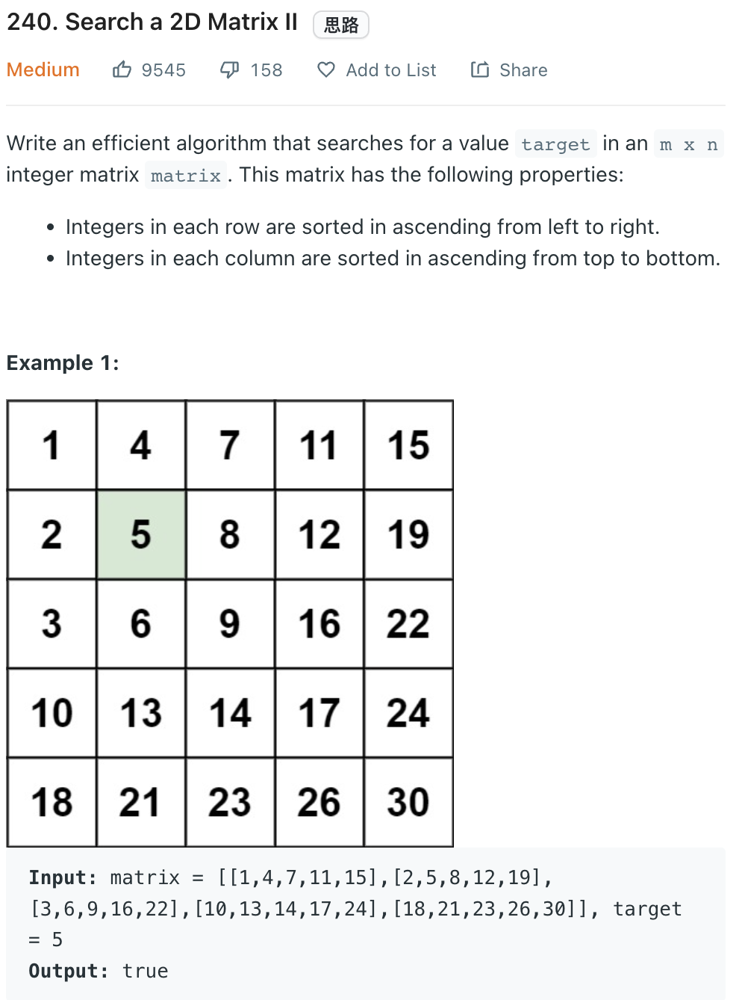

___
[240. Search a 2D Matrix II](https://leetcode.com/problems/search-a-2d-matrix-ii/)
___


## 基本思路
* Using binary search on each row and colum
* There is a trick to save some times
* The starting index of each binary search can be on diagonal

___

`Time complexity : O(log(n!))`

`Space complexity : O(1)`
```python
class Solution:
    def searchMatrix(self, matrix: List[List[int]], target: int) -> bool:
        minLength = min(len(matrix), len(matrix[0]))
        for i in range(minLength):
            vertical = self.vertical(matrix, target, i)
            horizontal = self.horizontal(matrix, target, i)
            if vertical or horizontal:
                return True
        return False
    
    
    def vertical(self, matrix, target, fixedCol):
        left = fixedCol
        right = len(matrix) - 1
        
        while left <= right:
            mid = left + (right - left) // 2
            if matrix[mid][fixedCol] == target:
                return True
            elif matrix[mid][fixedCol] > target:
                right = mid - 1
            else:
                left = mid + 1
        
        return False
        
    def horizontal(self, matrix, target, fixedRow):
        left = fixedRow
        right = len(matrix[0]) - 1
        
        while left <= right:
            mid = left + (right - left) // 2
            if matrix[fixedRow][mid] == target:
                return True
            elif matrix[fixedRow][mid] > target:
                right = mid - 1
            else:
                left = mid + 1
        
        return False
```