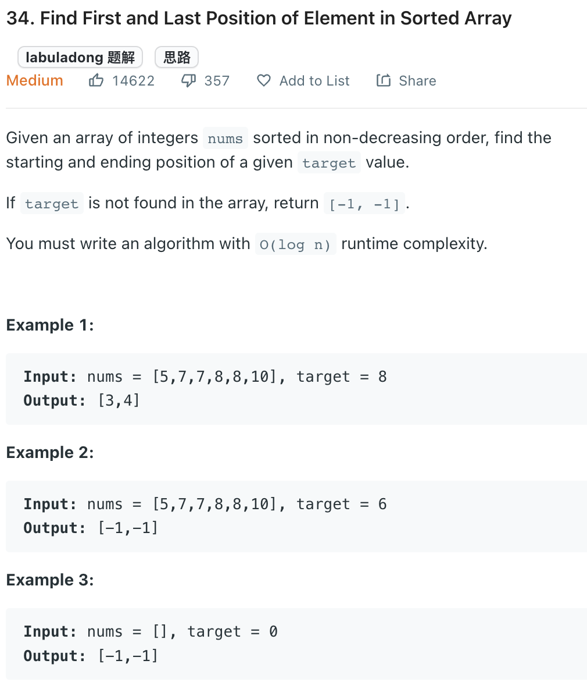

___
[34. Find First and Last Position of Element in Sorted Array](https://leetcode.com/problems/find-first-and-last-position-of-element-in-sorted-array/)
___


## 基本思路
* use Binary Search lower bound and upper bound

___

`Time complexity : O(nlogn)`

`Space complexity : O(1)`
```python
class Solution:
    def searchRange(self, nums: List[int], target: int) -> List[int]:
        
        def leftBound(nums, target):
            left, right = 0, len(nums) - 1
            
            while left <= right:
                mid = left + (right - left) // 2
                
                if nums[mid] < target:
                    left = mid + 1
                elif nums[mid] > target:
                    right = mid - 1
                elif nums[mid] == target:
                    right = mid - 1
            
            if left >= len(nums) or nums[left] != target:
                return -1
            
            return left
        
        def rightBound(nums, target):
            left, right = 0, len(nums) - 1
            
            while left <= right:
                mid = left + (right - left) // 2
                
                if nums[mid] < target:
                    left = mid + 1
                elif nums[mid] > target:
                    right = mid - 1
                elif nums[mid] == target:
                    left = mid + 1
            
            if right < 0 or nums[right] != target:
                return -1
            
            return right
        
        return [leftBound(nums, target), rightBound(nums, target)]
                
```