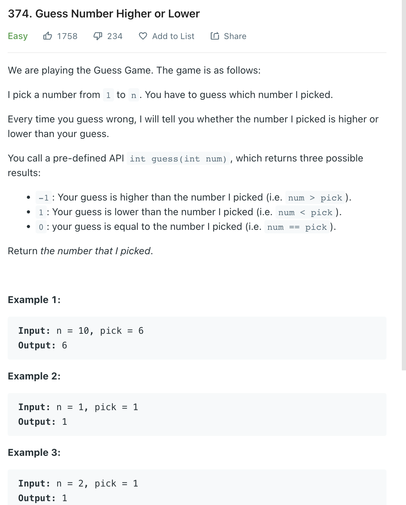

___
[374. Guess Number Higher or Lower](https://leetcode.com/problems/guess-number-higher-or-lower/)
___


## 基本思路
* This is a normal binary search

___

`Time complexity : O(log(n))`

`Space complexity : O(1)`
```python
class Solution:
    def guessNumber(self, n: int) -> int:
        left, right = 1, n
        while left <= right:
            mid = left + (right - left) // 2
            if guess(mid) == -1:
                right = mid - 1
            elif guess(mid) == 1:
                left = mid + 1
            else:
                return mid
        return -1
```