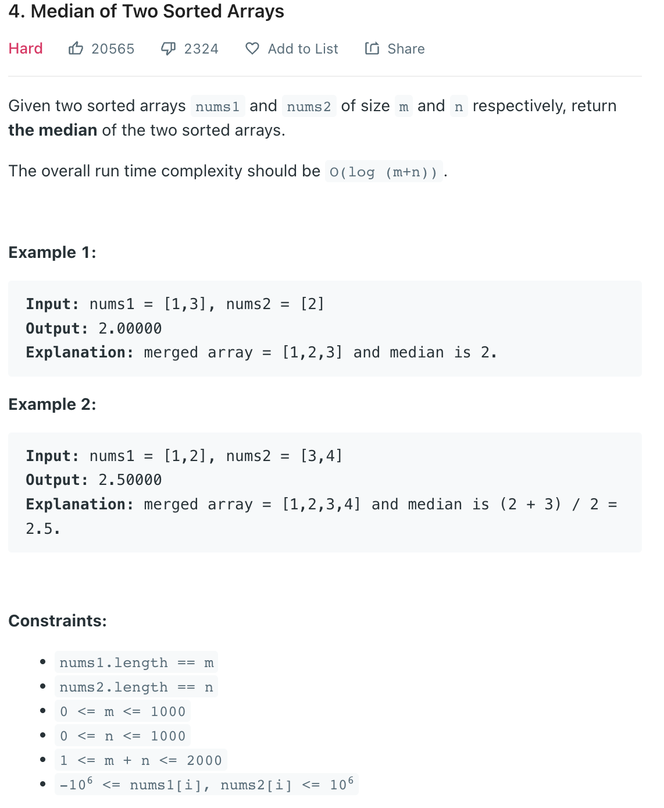

___
[4. Median of Two Sorted Arrays](https://leetcode.com/problems/median-of-two-sorted-arrays/)
___


## 基本思路
* This is a hard question.
* But i don't know how to use divide and conquer right now.
* So i make it as easy

___

`Time complexity : O(m + n)`

`Space complexity : O(m + n)`
```python
class Solution:
    def findMedianSortedArrays(self, nums1: List[int], nums2: List[int]) -> float:
        m, n = len(nums1), len(nums2)
        mergedArray = []
        index = index1 = index2 = 0
        
        while index1 < m and index2 < n:
            if nums1[index1] < nums2[index2]:
                mergedArray.append(nums1[index1])
                index1 += 1
            else:
                mergedArray.append(nums2[index2])
                index2 += 1
        while index1 < m:
            mergedArray.append(nums1[index1])
            index1 += 1
        while index2 < n:
            mergedArray.append(nums2[index2])
            index2 += 1
        
        if (m + n) % 2 != 0:
            return float(mergedArray[(m + n) // 2])
        else:
            index = (m + n) // 2
            return float(mergedArray[index - 1] + mergedArray[index]) / 2
```