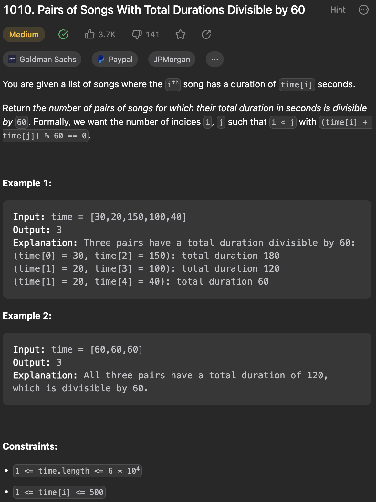

___
[1010. Pairs of Songs With Total Durations Divisible by 60](https://leetcode.com/problems/pairs-of-songs-with-total-durations-divisible-by-60/description/)
___

## 基本思路
* Using brute force is easy, but takes O(n^2)
* Here is another easy way of solving this.
* Counting.
* In short, we want to find two number (a, b) where index of a < index of b and (a + b) % 60 == 0
* a % 60 = 60 - b % 60
* Think of 2 sum, we want to find two numbers sum == 60

___

`Time complexity : O(N)`

`Space complexity : O(60)`
```java
class Solution {
    public int numPairsDivisibleBy60(int[] time) {
        int c[]  = new int[60], res = 0;
        for (int t : time) {
            res += c[(60 - t % 60) % 60];
            c[t % 60] += 1;
        }
        return res;
    }
}
```