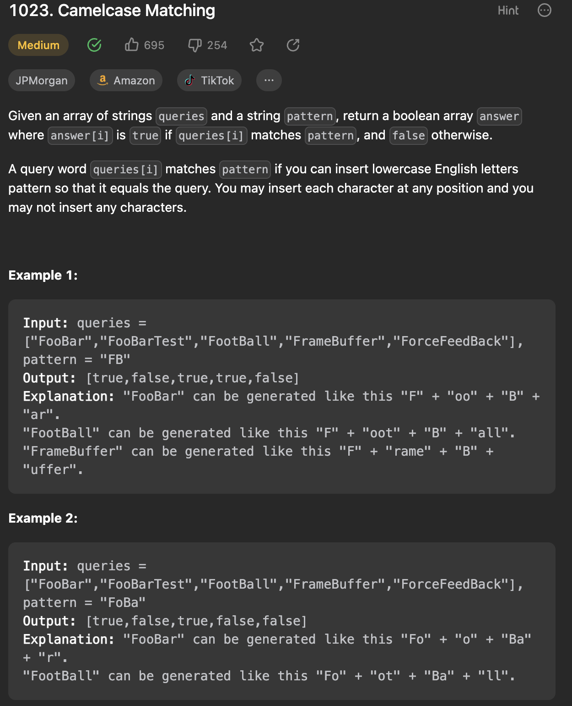

___
[1023. Camelcase Matching](https://leetcode.com/problems/camelcase-matching/description/)
___


## 基本思路
* The match process uses i for query pointer and j for pattern pointer, each iteration;
* If current char query[i] matches pattern[j], increase pattern pointer;
* if does not match and query[i] is lowercase, keep going;
* if does not match and query[i] is captalized, we should return false.
* If this pattern matches, j should equal length of pattern at the end.

___

`Time complexity : O()`

`Space complexity : O()`
```java
class Solution {
    public List<Boolean> camelMatch(String[] queries, String pattern) {
        List<Boolean> answer = new ArrayList<>();
        char[] patternArr = pattern.toCharArray();
        for (String word: queries) {
            answer.add(match(word.toCharArray(), patternArr));
        }
        return answer;
    }

    public boolean match(char[] word, char[] pattern) {
        int j = 0;
        for (int i = 0; i < word.length; i++) {
            if (j < pattern.length && word[i] == pattern[j]) {
                j++;
            } else if (word[i] >= 'A' && word[i] <= 'Z') {
                return false;
            }
        }
        return j == pattern.length;
    }
}

```