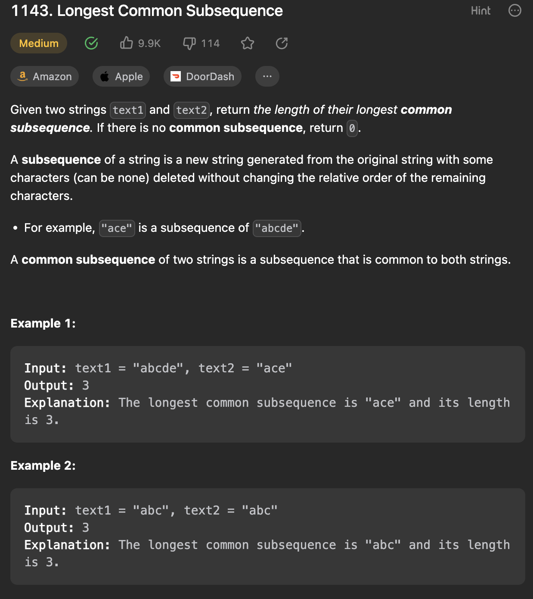

___
[1143. Longest Common Subsequence](https://leetcode.com/problems/longest-common-subsequence/description/)
___

## 基本思路
* This is a classic 2d DP question.

___

`Time complexity : O(m * n)`

`Space complexity : O(m * n)`
```java
class Solution {
    public int longestCommonSubsequence(String text1, String text2) {
        int m = text1.length();
        int n = text2.length();
        
        int[][] dp = new int[m + 1][n + 1];

        for (int i = 1; i <= m; i++) {
            for (int j = 1; j <= n; j++) {
                if (text1.charAt(i - 1) == text2.charAt(j - 1)) {
                    dp[i][j] = 1 + dp[i - 1][j - 1];
                } else {
                    dp[i][j] = Math.max(dp[i - 1][j], dp[i][j - 1]);
                }
            }
        }
        return dp[m][n];
    }
}
```