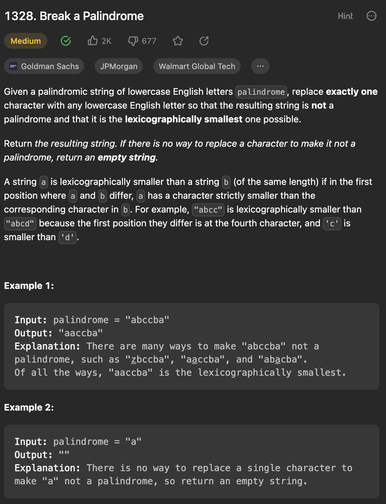

___
[1328. Break a Palindrome](https://leetcode.com/problems/break-a-palindrome/description/)
___

## 基本思路
* This is a greedy question.
```
Input: palindrome = "abccba"
Output: "aaccba"
Explanation: There are many ways to make "abccba" not a palindrome, such as "zbccba", "aaccba", and "abacba".
Of all the ways, "aaccba" is the lexicographically smallest.
```
* We need to find the smallest non-palindrome.
* If we see a char that is not 'a', we replace to 'a' and return;
* If the input is 'aa...', we just replace the last char to 'b'

___

`Time complexity : O(N)`

`Space complexity : O(N)`
```java
class Solution {
    public String breakPalindrome(String palindrome) {
        int length = palindrome.length();
        if (length == 1) { 
            return "";
        }
        // Strings are immutable in Java, convert it into a char array
        char[] palindromeArray = palindrome.toCharArray();
        
        for (int i = 0; i < length / 2; i++) {
            if (palindromeArray[i] != 'a') {
                palindromeArray[i] = 'a';
                return String.valueOf(palindromeArray);
            }
        }
        
        palindromeArray[length - 1] = 'b';
        return String.valueOf(palindromeArray);
    }
}
```