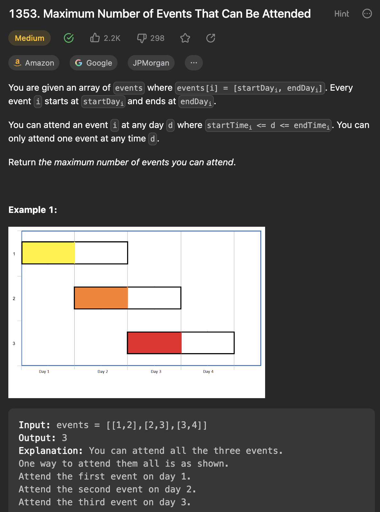

___
[1353. Maximum Number of Events That Can Be Attended](https://leetcode.com/problems/maximum-number-of-events-that-can-be-attended/description/)
___

## 基本思路
* This question is tricky.
* For example the input is `[[1,2], [1,2]]`
* The answer is 2, because in total, we have 2 days, `[1,2]` means you can choose to work on day 1 or day 2.
* 1. Sort the array by starting Day.
* 2. Having a PriorityQueue sort the end Day.
* The key point is each day can only use once.
* While the pq is not empty or we havn't go over all the events:
* We pick the statring dat of current event as our end day.
* For any event have the same starting day, we will put into pq, because we only sort by the starting day.
* No matter what happens, we know are able to attend the job at this day.
* pq.remove(), it will remove the eariest end day.
* answer++
* day++(Because we can only attend 1 job at 1 day) == new end day
* Finally we need to remove all events that we are not able to finish at the new end day.

___

`Time complexity : O(nlogn)`

`Space complexity : O(n)`
```java
class Solution {
    public int maxEvents(int[][] events) {
        Arrays.sort(events, (a, b) -> a[0] - b[0]);
        PriorityQueue<Integer> pq = new PriorityQueue<>();
        int index = 0, answer = 0, length = events.length, day = 0;

        while (!pq.isEmpty() || index < length) {
            if (pq.isEmpty()) {
                day = events[index][0];
            }
            while (index < length && events[index][0] == day) {
                pq.add(events[index++][1]);
            }
            pq.remove();
            answer++;
            day++;
            while (!pq.isEmpty() && pq.peek() < day) {
                pq.remove();
            }
        }
        return answer;
    }
}
```