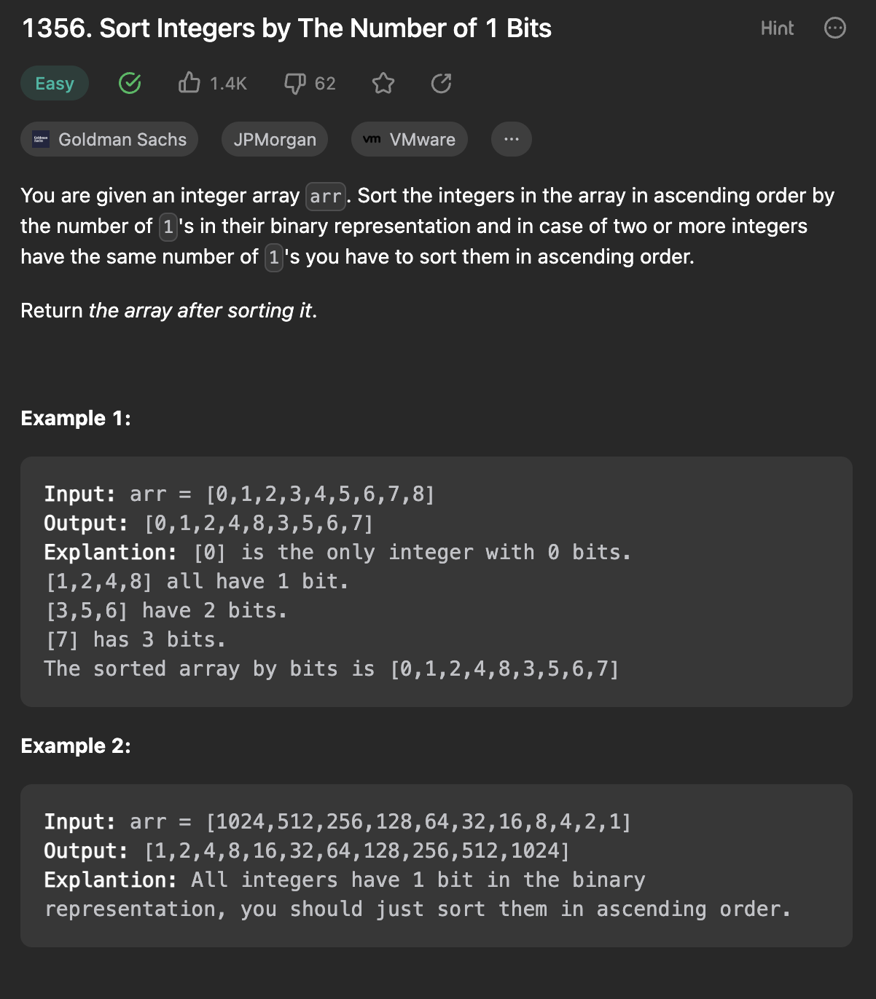

___
[1356. Sort Integers by The Number of 1 Bits](https://leetcode.com/problems/sort-integers-by-the-number-of-1-bits/description/)
___


## 基本思路
* Integer.bitCount(int)

___

`Time complexity : O(nlog(n))`

`Space complexity : O(n)`
```java
class Solution {  
    /** 
     Since the input values can range from 0 to 10000, we can add to each element on the array the value of the bit count (number of 1s) multiplied by 10001.
     10001 is not a magic number, it is merely the max possible number the array may have + 1, which ensures that the bit count has the maximum priority,
     and that we do not mistakenly erase a number when reverting the array back to its original values (after sorting).
     This approach is an effective way of sorting by more than one criteria, a similar logic could be applied to more complex problems.
    */ 
    public int[] sortByBits(int[] arr) {   
        // apply a bitcount modifier to the array values
        for(int i = 0; i < arr.length; i++) {
            arr[i] += Integer.bitCount(arr[i]) * 10001;
        }
        
        // sort the array, and remove the bitcount modifier
        Arrays.sort(arr);
        for(int i = 0; i < arr.length; i++) {
            arr[i] %= 10001;     
        }
        
        // return the sorted array
        return arr;
    }
}
```