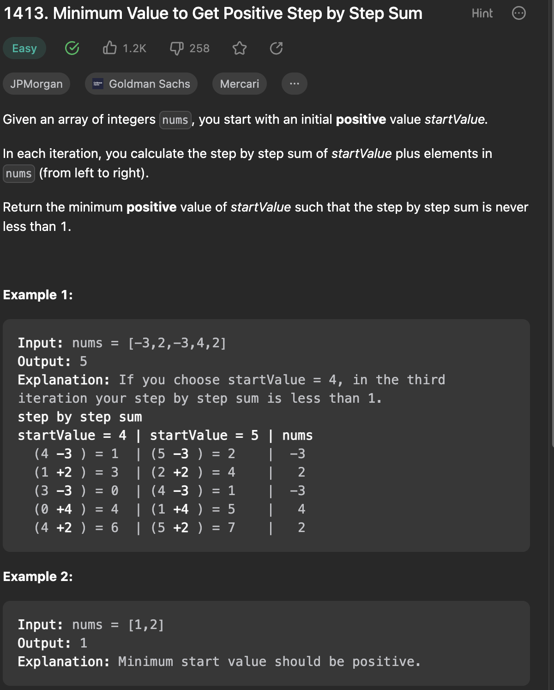

___
[1413. Minimum Value to Get Positive Step by Step Sum](https://leetcode.com/problems/minimum-value-to-get-positive-step-by-step-sum/description/)
___

## 基本思路
* This is an greedy question

___

`Time complexity : O(n)`

`Space complexity : O(1)`
```java
class Solution {
    public int minStartValue(int[] nums) {
        int answer = 1;
        int currentSum = 0;
        for (int i = 0; i < nums.length; i++) {
            nums[i] += currentSum;
            currentSum = nums[i];
            if (currentSum < 0) {
                answer = Math.max(Math.abs(currentSum) + 1, answer);
            }
        }

        return answer;
    }
}
```