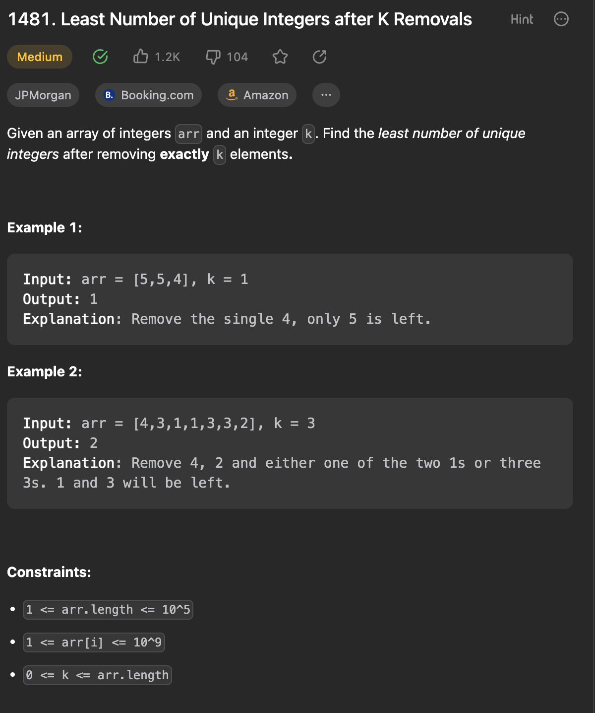

___
[1481. Least Number of Unique Integers after K Removals](https://leetcode.com/problems/least-number-of-unique-integers-after-k-removals/description/)
___


## 基本思路
* Count the frequency of each number and store into a map.
* Using the PriorityQueue to store the frequency of each number increasing order.
* Remove element while k > 0;
* `return k < 0 ? pq.size() + 1 : pq.size();`
* This line is really important.
* pq.size() is the number of unique element.
* While we removing k element in the pq, we might remove more than require.
* But num of total element is differenct with num of unique element

___

`Time complexity : O(n + klog(n))`

`Space complexity : O(n)`
```java
class Solution {
    public int findLeastNumOfUniqueInts(int[] arr, int k) {
        Map<Integer, Integer> counts = new HashMap<>();
        for (int num: arr) {
            counts.put(num, 1 + counts.getOrDefault(num, 0));
        }
        PriorityQueue<Integer> pq = new PriorityQueue<>(counts.values());
        while (k > 0) {
            k -= pq.remove();
        }
        return k < 0 ? pq.size() + 1 : pq.size();
    }
}
```