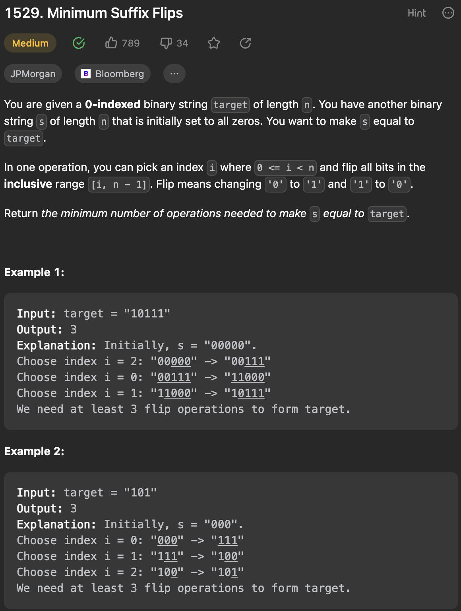

___
[1529. Minimum Suffix Flips](https://leetcode.com/problems/minimum-suffix-flips/description/)
___

## 基本思路
* We can work from left to right.
* Initially we start from `00000`. and target is `10111`
* First char not match, we flip, and become `11111`,
* Second char not match, we flip from second char, `10000`
* Third char not match, we flip from third char, `10111`
* Rest are the same.
* The key point is we don't need to do addtional flip if we find out the status is the same

___

`Time complexity : O(N)`

`Space complexity : O(1)`
```java
class Solution {
    public int minFlips(String target) {
        char prev = '0';
        int res = 0;
        for (char c : target.toCharArray()) {
            if (c != prev) {
                prev = c;
                res++;
            }
        }
        return res;
    }
}
```