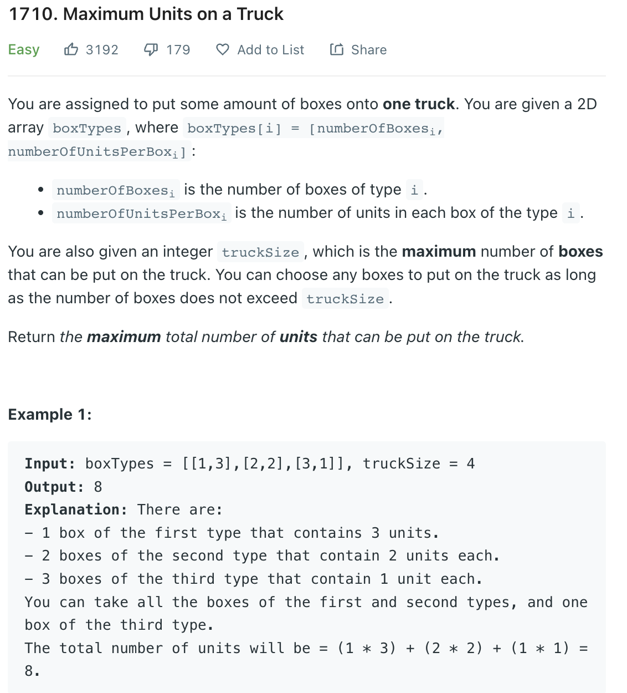

___
[1710. Maximum Units on a Truck](1710. Maximum Units on a Truck)
___


## 基本思路
* This is a greedy problem

___

`Time complexity : O(nlogn)`

`Space complexity : O(1)`
```java
class Solution {
    public int maximumUnits(int[][] boxTypes, int truckSize) {
        Arrays.sort(boxTypes, (a, b) -> b[1] - a[1]);
        int answer = 0;

        for (int i = 0; i < boxTypes.length; i++) {
            int boxes = boxTypes[i][0];
            int units = boxTypes[i][1];

            if (truckSize - boxes >= 0) {
                answer += boxes * units;
                truckSize -= boxes;
            } else {
                return answer + truckSize * units;
            }
        }
        
        return answer;
    }
}
```