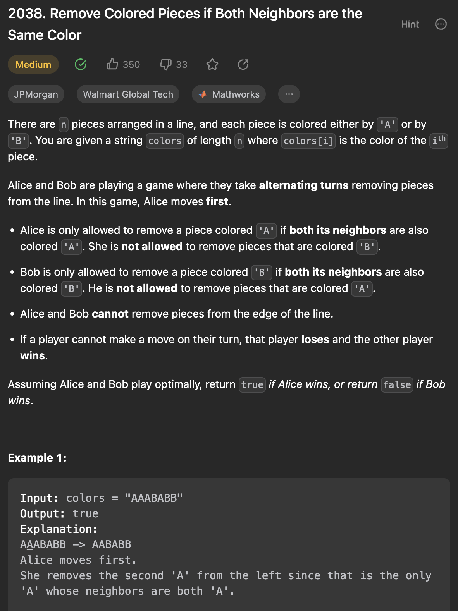

___
[2038. Remove Colored Pieces if Both Neighbors are the Same Color](https://leetcode.com/problems/remove-colored-pieces-if-both-neighbors-are-the-same-color/description/)
___


## 基本思路
* This is a greedy question.
* All we need to do is count num of `AAA` and `BBB`

___

`Time complexity : O(n)`

`Space complexity : O(1)`
```java
class Solution {
    public boolean winnerOfGame(String colors) {
        int a = 0, b = 0;
        for (int i = 1; i < colors.length() - 1; i++) {
            if (colors.charAt(i - 1) == colors.charAt(i) &&
                colors.charAt(i) == colors.charAt(i + 1)) {
                    if (colors.charAt(i) == 'A') {
                        a++;
                    } else {
                        b++;
                    }
                }
        }
        return a > b;
    }
}
```