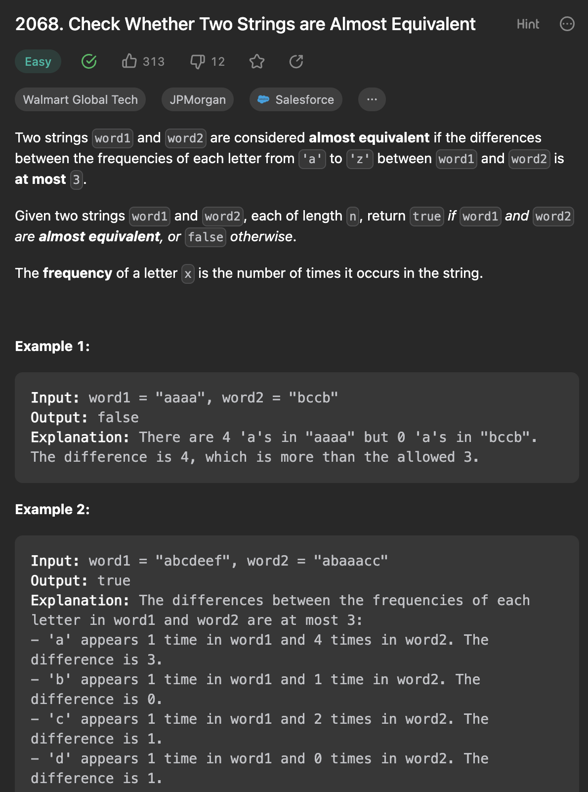

___
[2068. Check Whether Two Strings are Almost Equivalent](https://leetcode.com/problems/check-whether-two-strings-are-almost-equivalent/description/)
___

## 基本思路
* Count

___

`Time complexity : O(n)`

`Space complexity : O(1)`
```java
class Solution {
    public boolean checkAlmostEquivalent(String word1, String word2) {
        int[] count1 = new int[26];
        int[] count2 = new int[26];

        for (int i = 0; i < word1.length(); i++) {
            count1[word1.charAt(i) - 'a']++;
            count2[word2.charAt(i) - 'a']++;
        }
        for (int i = 0; i < 26; i++) {
            if (Math.abs(count1[i] - count2[i]) > 3) {
                return false;
            }
        }
        return true;
    }
}
```