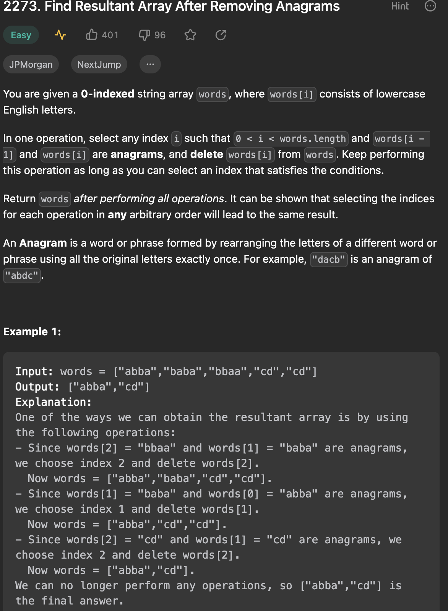

___
[2273. Find Resultant Array After Removing Anagrams](https://leetcode.com/problems/find-resultant-array-after-removing-anagrams/description/)
___


## 基本思路
* 

___

`Time complexity : O(n)`

`Space complexity : O(1)`
```java
class Solution {
    public List<String> removeAnagrams(String[] words) {
        List<String> answer = new ArrayList<>();
        String previous = "";
        for (int i = 0; i < words.length; i++) {
            String word = words[i];
            char[] counts = new char[26];
            for (char c: word.toCharArray()) {
                counts[c - 'a']++;
            }
            String key = String.valueOf(counts);
            if (!previous.equals(key)) {
                answer.add(word);
                previous = key;
            }
        }
        return answer;
    }
}
```