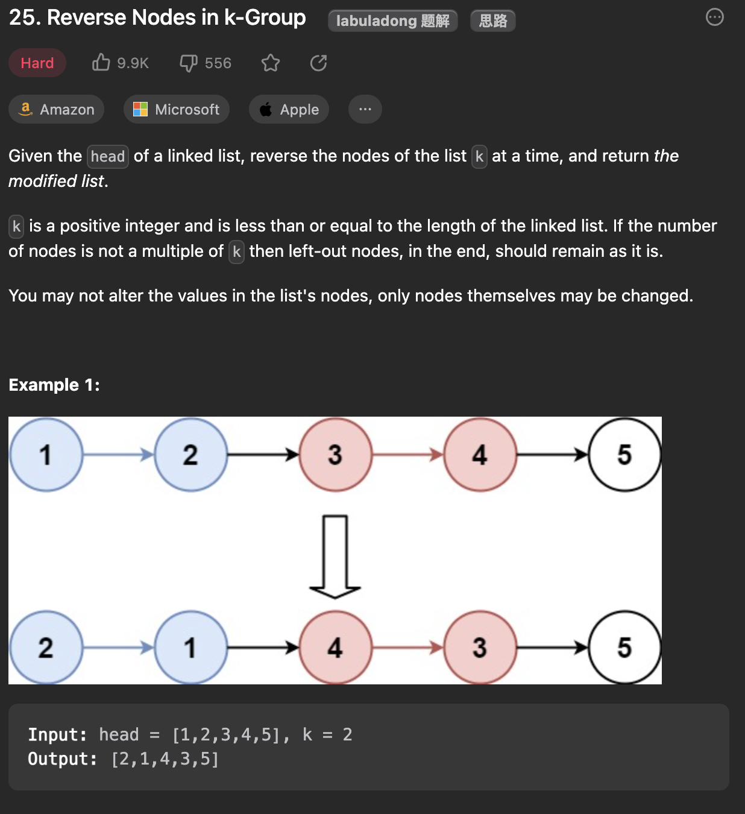

___
[25. Reverse Nodes in k-Group](https://leetcode.com/problems/reverse-nodes-in-k-group/)
___


## 基本思路
* Write reverseLinkedList first, then recursivlly call.

___

`Time complexity : O(n)`

`Space complexity : O(1)`
```java
class Solution {
    public ListNode reverseKGroup(ListNode head, int k) {
        if (head == null) { return null; }
        ListNode a, b;
        a = b = head;
        for (int i = 0; i < k; i++) {
            if (b == null) { return head; }
            b = b.next;
        }
        ListNode newHead = reverse(a, b);
        a.next = reverseKGroup(b, k);
        return newHead;
    }

    public ListNode reverse(ListNode head, ListNode tail) {
        ListNode previous, current, next;
        previous = null;
        current = head;
        next = head;

        while (current != tail) {
            next = current.next;
            current.next = previous;
            previous = current;
            current = next;
        }

        return previous;
    }
}
```