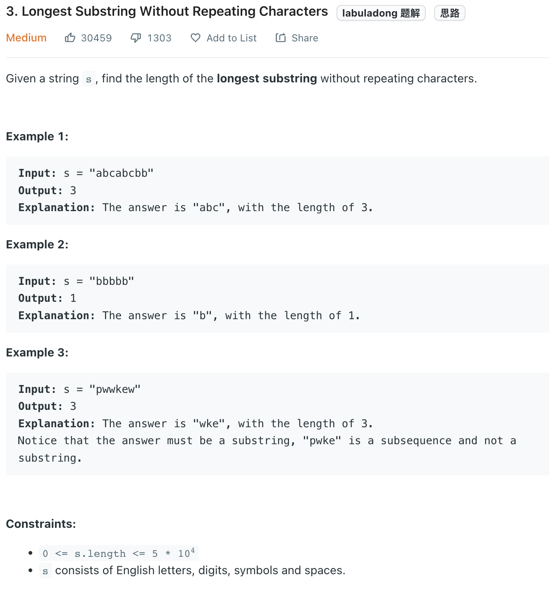

___
[3. Longest Substring Without Repeating Characters](https://leetcode.com/problems/longest-substring-without-repeating-characters/)
___

## 基本思路
* The window size is not fixed.
* We move left when we see duplicate.
* We stop left when current char is no longer duplicate

___

`Time complexity : O(n)`

`Space complexity : O(26)`
```python
class Solution:
    def lengthOfLongestSubstring(self, s: str) -> int:
        answer = 0
        left = right = 0
        dic = {}
        while right < len(s):
            char = s[right]
            right += 1
            dic[char] = dic.get(char, 0) + 1
            while dic[char] > 1:
                c = s[left]
                dic[c] -= 1
                left += 1
                
            answer = max(answer, right - left)
        return answer
```