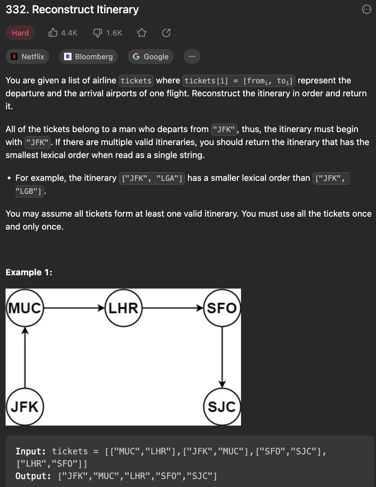
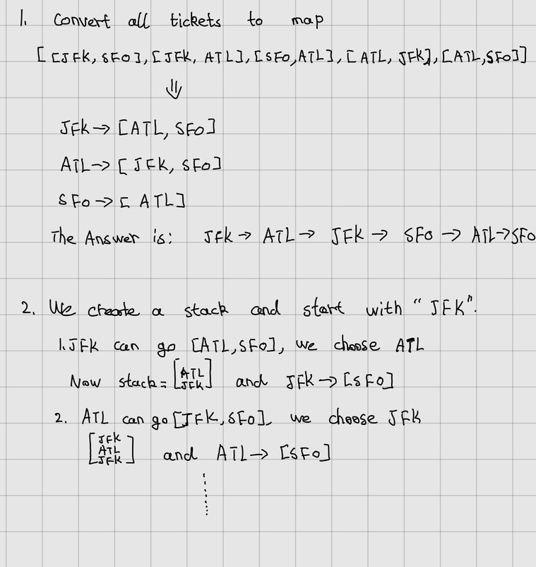

___
[332. Reconstruct Itinerary](https://leetcode.com/problems/reconstruct-itinerary/description/)
___


## 基本思路
* 

___

`Time complexity : O(n)`

`Space complexity : O(n)`
```java
class Solution {
    public List<String> findItinerary(List<List<String>> tickets) {
        Map<String, PriorityQueue<String>> map = new HashMap<>();
        for (List<String> ticket: tickets) {
            if (map.get(ticket.get(0)) == null) {
                map.put(ticket.get(0), new PriorityQueue<>());
            }
            map.get(ticket.get(0)).add(ticket.get(1));
        }
        List<String> answer = new ArrayList<>();
        Stack<String> stack = new Stack<>();
        stack.push("JFK");
        while (!stack.isEmpty()) {
            while (map.containsKey(stack.peek()) && !map.get(stack.peek()).isEmpty()) {
                stack.push(map.get(stack.peek()).poll());
            }
            answer.add(0, stack.pop());
        }
        return answer;
    }
}
```