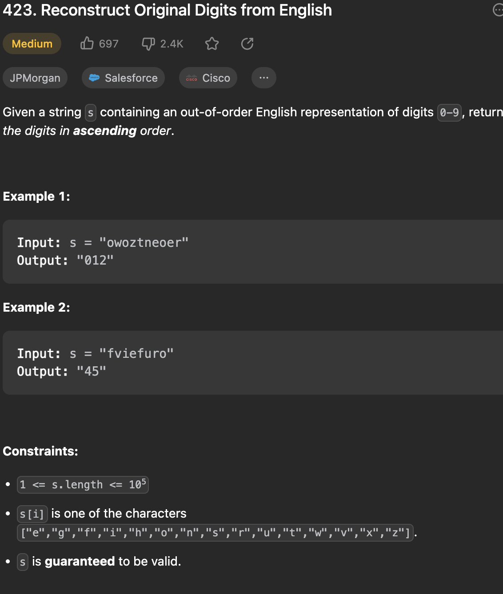

___
[423. Reconstruct Original Digits from English](https://leetcode.com/problems/reconstruct-original-digits-from-english/description/)
___


## 基本思路
* 傻逼问题
* Write down.
* For example, `w` only in `2`, `g` only in `8`

___

`Time complexity : O(N)`

`Space complexity : O(10)`
```java
class Solution {
    public String originalDigits(String s) {
        int[] count = new int[10];
        for (char c: s.toCharArray()) {
            if (c == 'w') { count[2]++; }
            if (c == 'u') { count[4]++; }
            if (c == 'x') { count[6]++; }
            if (c == 'g') { count[8]++; }
            if (c == 'z') { count[0]++; }
            //----------------------------
            if (c == 'h') { count[3]++; }
            if (c == 'f') { count[5]++; }
            if (c == 's') { count[7]++; }
            //----------------------------
            if (c == 'o') { count[1]++; }
            if (c == 'i') { count[9]++; }
        }
        count[3] -= count[8];
        count[5] -= count[4];
        count[7] -= count[6];
        count[1] = count[1] - count[2] - count[4] - count[0];
        count[9] = count[9] - count[5] - count[6] - count[8];
        StringBuilder sb = new StringBuilder();
        for (int i = 0; i < 10; i++) {
            for (int j = 0; j < count[i]; j++) {
                sb.append(i);
            }
        }
        return sb.toString();
    }
}
```