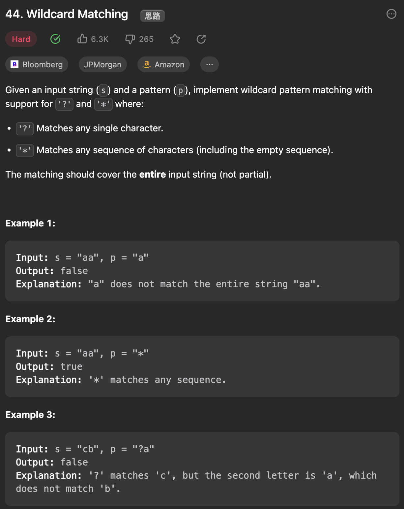
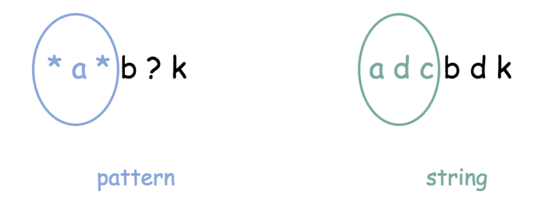
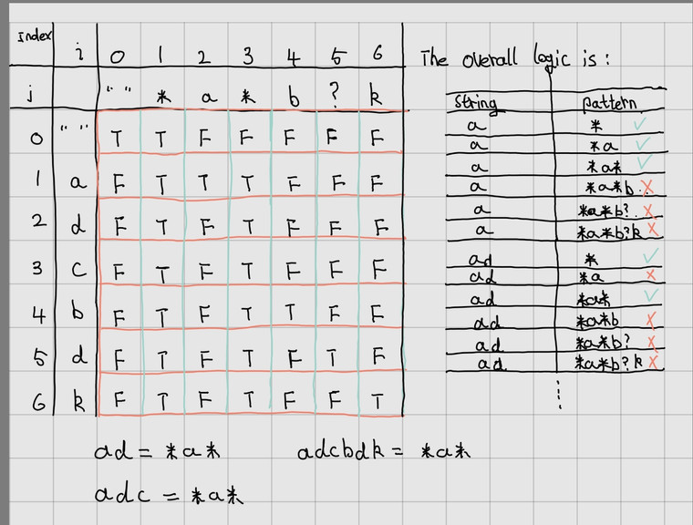

___
[44. Wildcard Matching](https://leetcode.com/problems/wildcard-matching/description/)
___

## 基本思路
* People call it classic 2d dp, but this is my first time.
* They are matching 
* 
* `*a* == adc`
* `dp[i][j] = true` mean substring[0, i] of string == substring[0, j] of pattern.
* 

___

`Time complexity : O(sLength * pLength)`

`Space complexity : O(sLength * pLength)`
```java
class Solution {
    public boolean isMatch(String s, String p) {
        int sLength = s.length();
        int pLength = p.length();

        boolean[][] dp = new boolean[sLength + 1][pLength + 1];
        dp[0][0] = true;

        for (int i = 1; i <= pLength; i++) {
            if (p.charAt(i - 1) == '*') {
                dp[0][i] = dp[0][i - 1];
            } else {
                break;
            }
        }

        for (int i = 1; i <= sLength; i++) {
            for (int j = 1; j <= pLength; j++) {
                if (s.charAt(i - 1) == p.charAt(j - 1) || p.charAt(j - 1) == '?') {
                    dp[i][j] = dp[i - 1][j - 1];
                } else if (p.charAt(j - 1) == '*') {
                    dp[i][j] = dp[i - 1][j] || dp[i][j - 1];
                }
            }
        }
        return dp[sLength][pLength];
    }
}
```