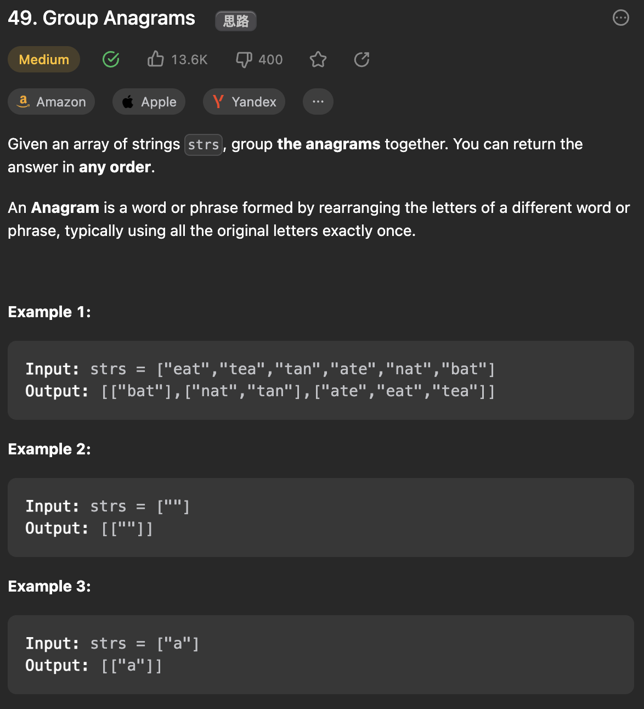

___
[49. Group Anagrams](https://leetcode.com/problems/group-anagrams/description/)
___

## 基本思路
* Store the frequency of each char in each word into the map.

___

`Time complexity : O()`

`Space complexity : O()`
```java
class Solution {
    public List<List<String>> groupAnagrams(String[] strs) {
        if (strs == null || strs.length == 0) return new ArrayList<>();
        Map<String, List<String>> map = new HashMap<>();
        for (String s : strs) {
            char[] ca = new char[26];
            for (char c : s.toCharArray()) ca[c - 'a']++;
            String keyStr = String.valueOf(ca);
            if (!map.containsKey(keyStr)) map.put(keyStr, new ArrayList<>());
            map.get(keyStr).add(s);
        }
        return new ArrayList<>(map.values());
    }
}
```