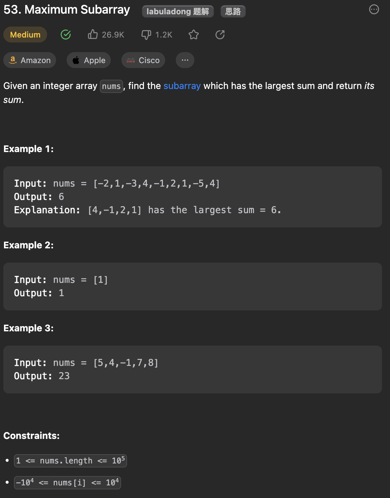

___
[53. Maximum Subarray](https://leetcode.com/problems/maximum-subarray/description/)
___


## 基本思路
* This is a dp question.
* For each element, we can decide to choose or not based on certein conditions.
* if currentSum + num > num, we want this num
* else, we reset the currentSum.

___

`Time complexity : O(n)`

`Space complexity : O(1)`
```java
class Solution {
    public int maxSubArray(int[] nums) {
        int answer = nums[0], currentSum = nums[0];

        for (int i = 1; i < nums.length; i++) {
            int num = nums[i];
            if (currentSum + num > num) {
                currentSum += num;
            } else {
                currentSum = num;
            }
            answer = Math.max(answer, currentSum);
        }
        return answer;
    }
}
```