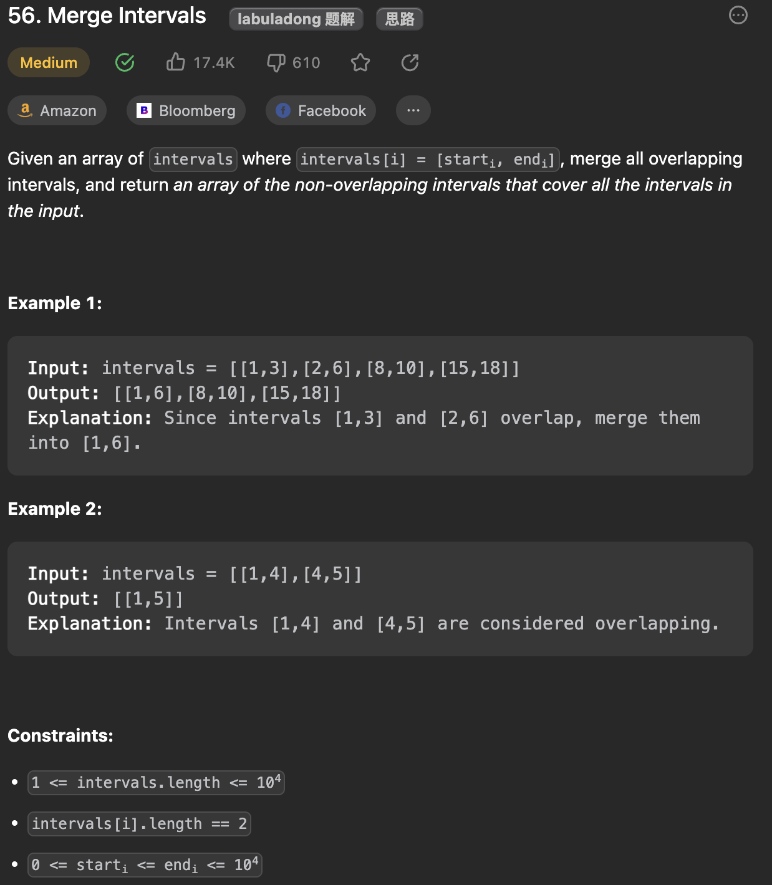

___
[56. Merge Intervals](https://leetcode.com/problems/merge-intervals/description/)
___


## 基本思路
* 

___

`Time complexity : O(nlog(n))`

`Space complexity : O(1)`
```java
class Solution {
    public int[][] merge(int[][] intervals) {
        Arrays.sort(intervals, (a, b) -> {
            if (a[0] == b[0]) { return a[1] - b[1]; }
            return a[0] - b[0];
        });
        List<int[]> list = new ArrayList<>();
        for (int[] interval: intervals) {
            if (list.size() == 0) {
                list.add(interval);
            } else if (list.get(list.size() - 1)[1] >= interval[0]) {
                list.get(list.size() - 1)[1] = Math.max(interval[1], list.get(list.size() - 1)[1]);
            } else {
                list.add(interval);
            }
        }
        return list.toArray(new int[list.size()][]);
    }
}
```