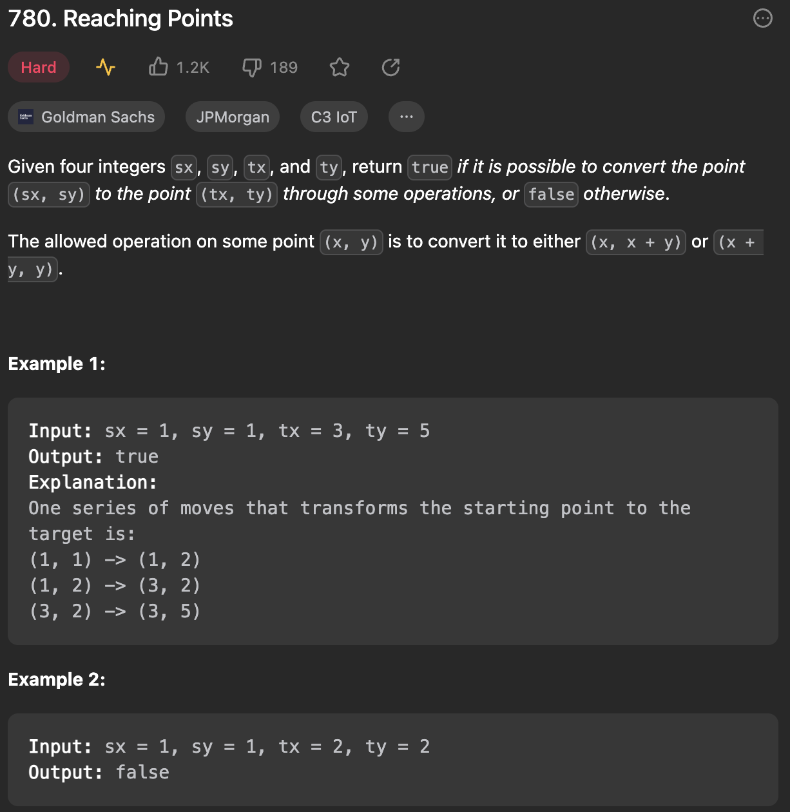

___
[780. Reaching Points](https://leetcode.com/problems/reaching-points/)
___

## 基本思路
* We know the answer, so we can work backward.

___

`Time complexity : O(max(tx,ty))`

`Space complexity : O(1)`
```java
class Solution {
    public boolean reachingPoints(int sx, int sy, int tx, int ty) {
        while (tx >= sx && ty >= sy) {
            if (sx == tx && sy == ty)
                return true;
            if (tx > ty) tx -= ty;
            else ty -= tx;
        }
        return false;
    }
}
```