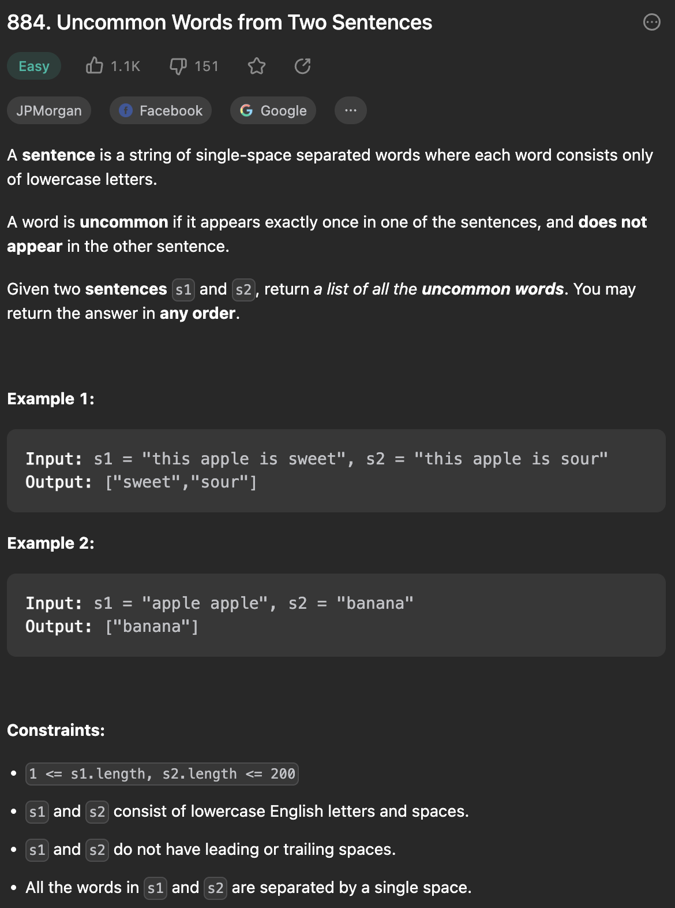

___
[884. Uncommon Words from Two Sentences](https://leetcode.com/problems/uncommon-words-from-two-sentences/description/)
___


## 基本思路
* Put all words form both strings into map.
* Check if is there any word appears only once.

___

`Time complexity : O(N + M)`

`Space complexity : O(N + M)`
```java
class Solution {
    public String[] uncommonFromSentences(String s1, String s2) {
        Map<String, Integer> map = new HashMap<>();

        for (String s: s1.split(" ")) {
            map.put(s, map.getOrDefault(s, 0) + 1);
        }

        for (String s: s2.split(" ")) {
            map.put(s, map.getOrDefault(s, 0) + 1);
        }

        List<String> answer = new ArrayList<>();
        for (String s: map.keySet()) {
            if (map.get(s) == 1) {
                answer.add(s);
            }
        }

        return answer.toArray(new String[answer.size()]);
    }
}
```