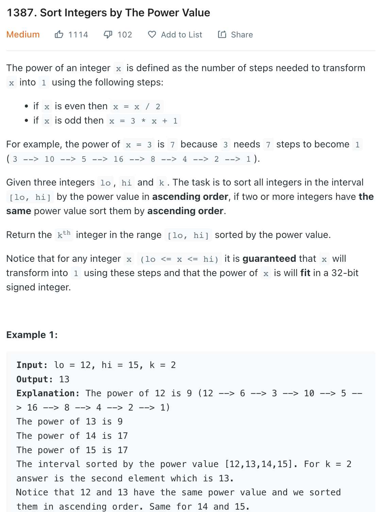

___
[1387. Sort Integers by The Power Value](https://leetcode.com/problems/sort-integers-by-the-power-value/)
___


## 基本思路
* The code is quite messy but works.
* This is a pretty straight forward.
* Save the step of a number we already found.

___

`Time complexity : O()`

`Space complexity : O()`
```python
class Solution:
    def getKth(self, lo: int, hi: int, k: int) -> int:
        powerSteps = {1: 0}
        numDic = {}
        for num in range(lo, hi + 1):
            tempNum = num
            temp = []
            while num not in powerSteps:
                temp.append(num)
                if num % 2 == 0:
                    num = num // 2
                else:
                    num = 3 * num + 1
            currentSteps = powerSteps[num]
            for steps in range(len(temp) - 1, -1, -1):
                powerSteps[temp[steps]] = len(temp) - steps + currentSteps
            numDic[tempNum] = powerSteps[tempNum]
        
        answer = [x[0] for x in sorted(numDic.items(), key=lambda x:x[1])]
        return answer[k - 1]
        
```

___

```python
class Solution:
    def getKth(self, lo: int, hi: int, k: int) -> int:
        powerSteps = {1: 0}
        numDic = {}
        
        def dfs(num):
            if num in powerSteps:
                return powerSteps[num]
            copyNum = num
            if num % 2 == 0:
                num = num // 2
            else:
                num = 3 * num + 1
            steps = 1 + dfs(num)
            powerSteps[copyNum] = steps
            return steps
        
        for i in range(lo, hi + 1):
            dfs(i)
            numDic[i] = powerSteps[i]
       
        answer = [x[0] for x in sorted(numDic.items(), key=lambda x:x[1])]
        return answer[k - 1]
```