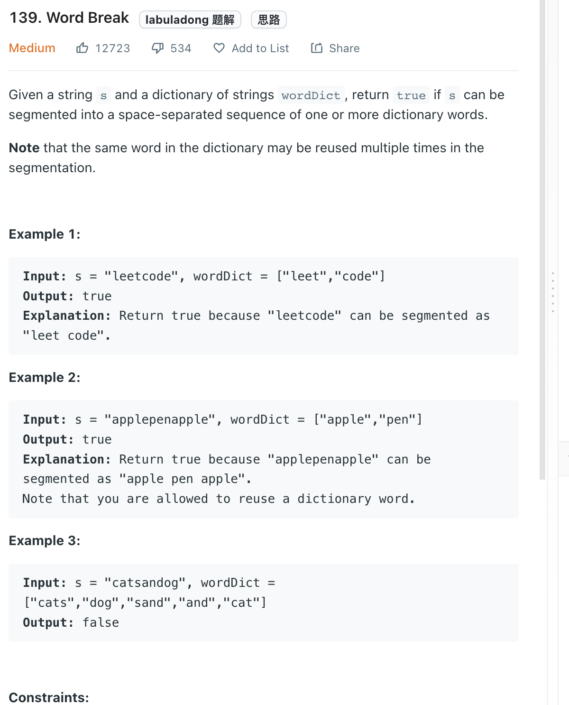

___
[139. Word Break](https://leetcode.com/problems/word-break/)
___


## 基本思路
* `dp[i] == True` mean we already checked `s[0: i+1]` and we can find the correspond word in `word_set`
* `if s[i: j] in word_set and dp[i]:` this line is really important.'

```
Input: s = "catsandog", wordDict = ["cats","dog","sand","and","cat"]
Output: false
```
* Take above example.
* The last word is dog, and we have dog in `word_set`, but its still not the answer

___

`Time complexity : O(n^3)`

`Space complexity : O(n)`
```python
class Solution:
    def wordBreak(self, s: str, wordDict: List[str]) -> bool:
        dp = [False] * (len(s) + 1)
        dp[0] = True
        
        word_set = set(wordDict)
        
        for i in range(len(s)):
            for j in range(i + 1, len(s) + 1):
                if s[i: j] in word_set and dp[i]:
                    dp[j] = True
                    
        return dp[-1]
```

___

```java
public class Solution {
    public boolean wordBreak(String s, List<String> wordDict) {
        return wordBreakMemo(s, new HashSet<>(wordDict), 0, new Boolean[s.length()]);
    }

    private boolean wordBreakMemo(String s, Set<String> wordDict, int start, Boolean[] memo) {
        if (start == s.length()) {
            return true;
        }
        if (memo[start] != null) {
            return memo[start];
        }
        for (int end = start + 1; end <= s.length(); end++) {
            if (wordDict.contains(s.substring(start, end)) && wordBreakMemo(s, wordDict, end, memo)) {
                memo[start] = true;
                return memo[start];
            }
        }
        memo[start] = false;
        return memo[start];
    }
}
```