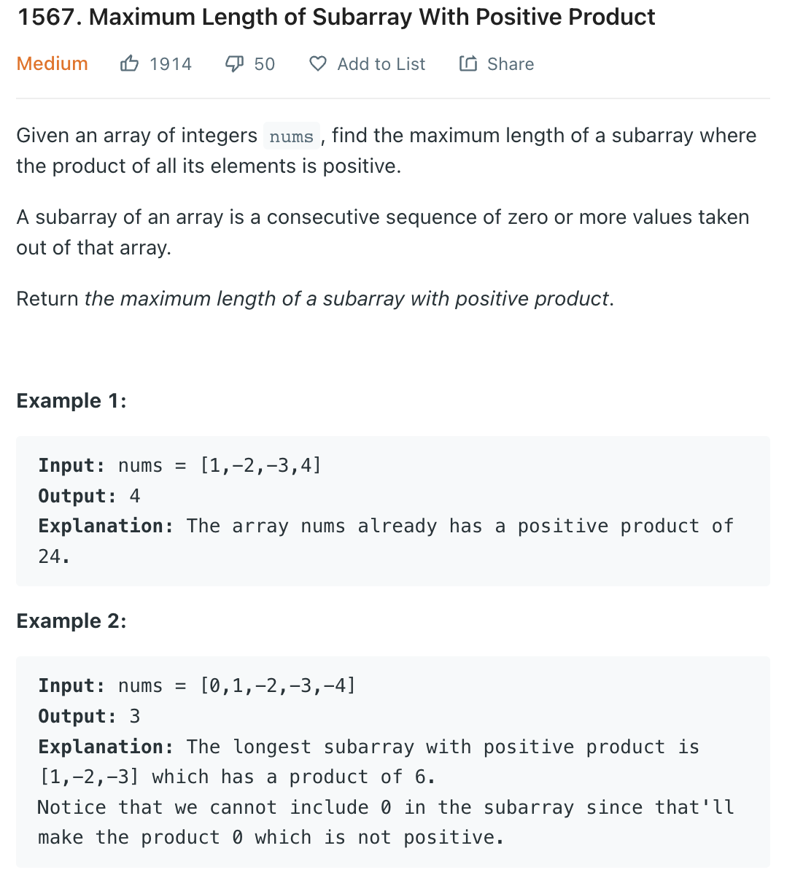
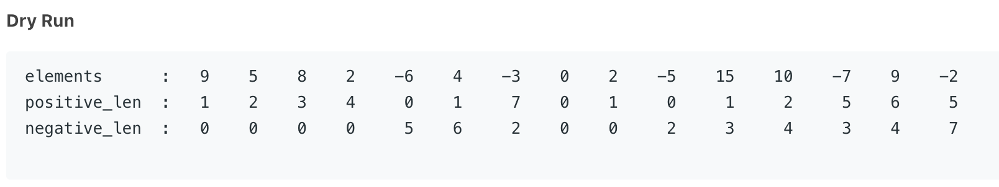

___
[1567. Maximum Length of Subarray With Positive Product](https://leetcode.com/problems/maximum-length-of-subarray-with-positive-product/)
___


## 基本思路
* For this type of question, we need to keep track of both positive and negitive
* I copied from website, and i might will lose my memory within few days



___

`Time complexity : O(n)`

`Space complexity : O(1)`
```python
class Solution:
    def getMaxLen(self, nums: List[int]) -> int:
        positive = negitive = 0
        
        answer = 0
        
        for num in nums:
            if num == 0:
                positive = negitive = 0
            elif num > 0:
                positive += 1
                negitive = negitive + 1 if negitive != 0 else 0
            else:
                temp = positive
                positive = negitive + 1 if negitive != 0 else 0
                negitive = temp + 1
        
            answer = max(answer, positive)
        return answer
```