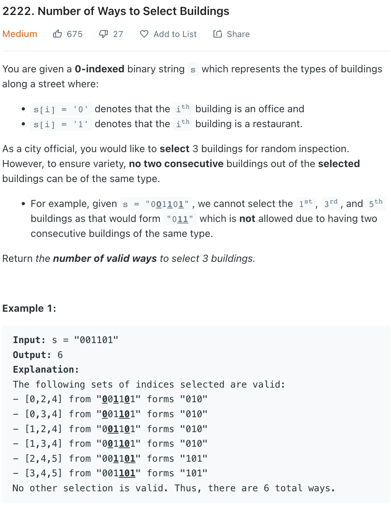

___
[2222. Number of Ways to Select Buildings](https://leetcode.com/problems/number-of-ways-to-select-buildings/)
___


## 基本思路
* This is really hard to think of it.
* I remember a similar question(string problem) but i forgot the details.
* If you meet 2 `0` `0'`and now you see a `1`, now you can form `01` and `0'1`
* If you see another `0` in the future, you know you can form  `010` and `0'10`
* Follow this idea, you might found out the answer

___

`Time complexity : O()`

`Space complexity : O()`
```python
class Solution:
    def numberOfWays(self, s: str) -> int:
        dp = {"0": 0, "1": 0, "01": 0, "10": 0, "010": 0, "101": 0}
        for i in range(len(s)):
            if s[i] == "0":
                dp["0"] += 1
                dp["10"] += dp["1"] # Each of the previously found 1s can pair up with the current 0 to form 10
                dp["010"] += dp["01"] # Each of the previously formed 01 can form a triplet with the current 0 to form 010
            if s[i] == "1":
                dp["1"] += 1
                dp["01"] += dp["0"] # Each of the previously found 0s can pair to form 01
                dp["101"] += dp["10"] # Each of the previously formed 10 can form 101
                
        return dp["010"] + dp["101"]
```