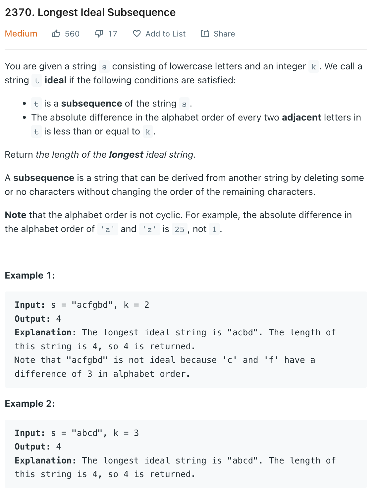
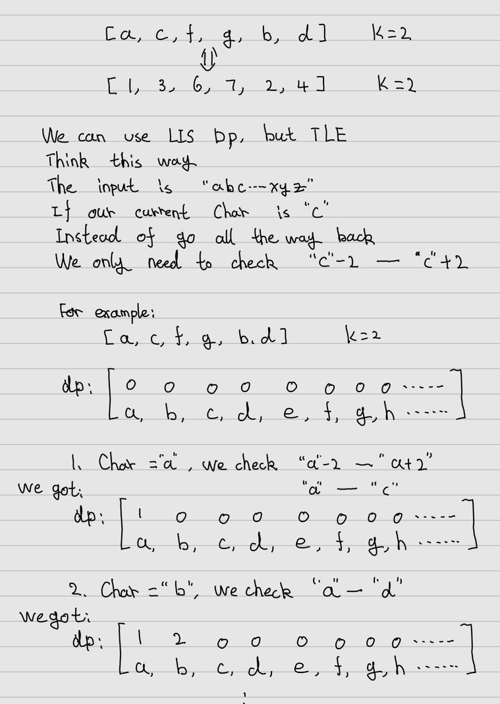

___
[2370. Longest Ideal Subsequence](https://leetcode.com/problems/longest-ideal-subsequence/)
___


## 基本思路
* 

___

`Time complexity : O(n)`

`Space complexity : O(1)`
```python
class Solution:
    def longestIdealString(self, s: str, k: int) -> int:
        length = len(s)
        dp = [0 for _ in range(26)]
        answer = 0
        for c in s:
            i = ord(c) - ord('a')
            dp[i] += 1
            for j in range(max(0, i - k), min(25, i + k) + 1):
                if i != j:
                    dp[i] = max(dp[i], dp[j] + 1)
                    
            answer = max(answer, dp[i])
        return answer
```