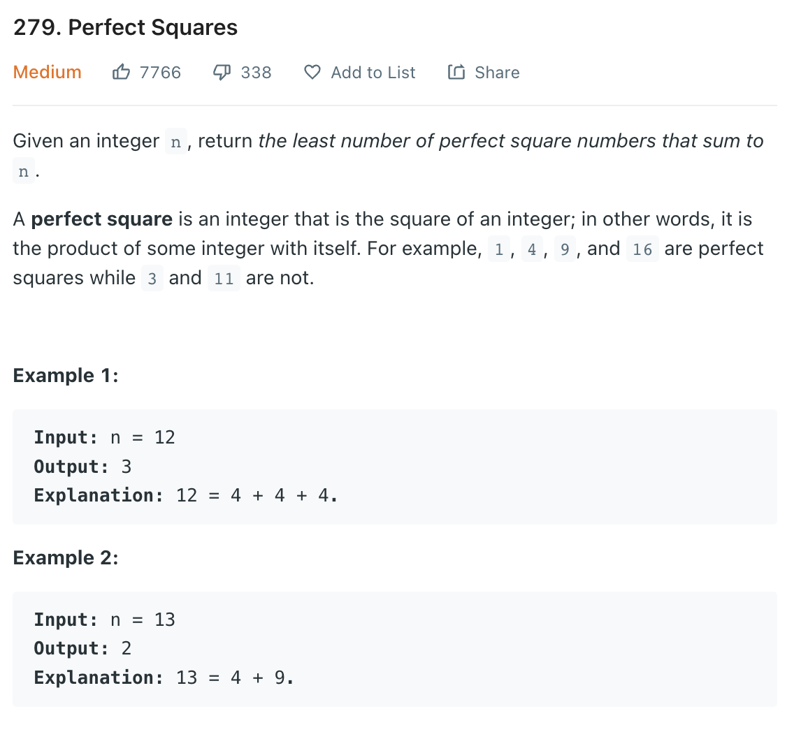
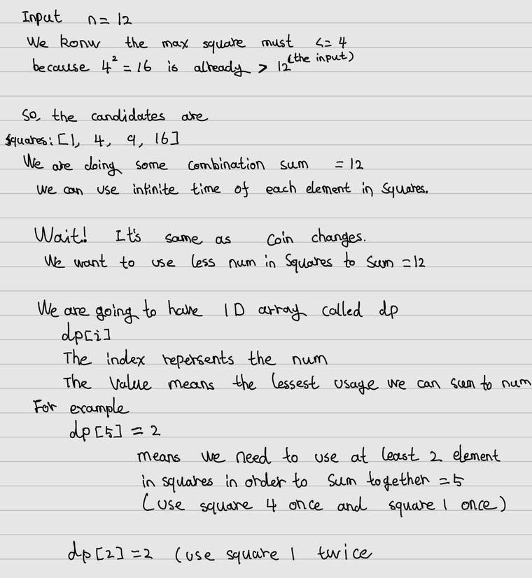

___
[279. Perfect Squares](https://leetcode.com/problems/perfect-squares/)
___

## 基本思路
* 

___

`Time complexity : O(n * sqrt(n))`

`Space complexity : O(n)`
```java
class Solution {
    public int numSquares(int n) {
        int maxSquare = (int) Math.sqrt(n) + 1;
        int[] dp = new int[n + 1];
        int[] squares = new int[maxSquare];
        
        for (int i = 1; i <= maxSquare; i++) {
            squares[i - 1] = i * i;
        }
        Arrays.fill(dp, Integer.MAX_VALUE);
        dp[0] = 0;

        for (int num = 1; num <= n; num++) {
            for (int square: squares) {
                if (num < square) {
                    break;
                }
                dp[num] = Math.min(dp[num], dp[num - square] + 1);
            }
        }
        return dp[n];
    }
}
```