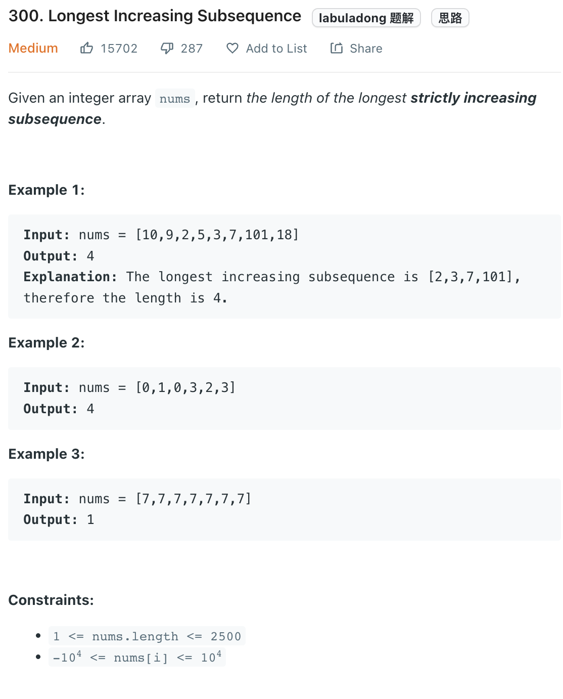

___
[300. Longest Increasing Subsequence](https://leetcode.com/problems/longest-increasing-subsequence/)
___

## 基本思路
* We store how many nums are smaller than current num
* dp[i], means at index i, there are total dp[i]'s nums less that nums[i]

___

`Time complexity : O(n^2)`

`Space complexity : O(n)`
```python
class Solution:
    def lengthOfLIS(self, nums: List[int]) -> int:
        length = len(nums)
        dp = [1 for _ in range(length)]
        
        for i in range(length):
            for j in range(i):
                if nums[i] > nums[j]:
                    dp[i] = max(dp[i], dp[j] + 1)
                    
        return max(dp)
```