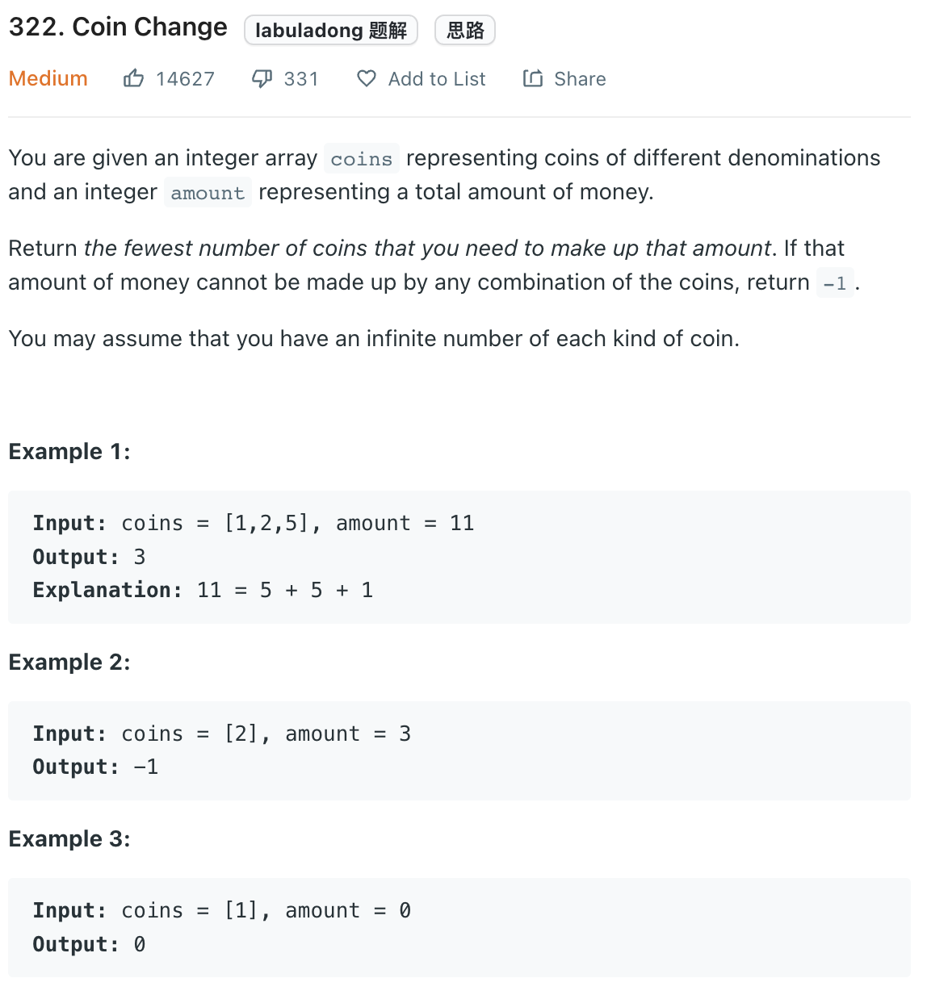

___
[322. Coin Change](https://leetcode.com/problems/coin-change/)
___

## 基本思路
* 

___
`N is amount, M is len(coins)`

`Time complexity : O(NM)`

`Space complexity : O(N)`
```java
class Solution {
    public int coinChange(int[] coins, int amount) {
        Arrays.sort(coins);

        int[] dp = new int[amount + 1];
        Arrays.fill(dp, Integer.MAX_VALUE);
        dp[0] = 0;
        for (int money = 1; money <= amount; money++) {
            for (int coin: coins) {
                if (money < coin) { break; }
                if (dp[money - coin] != Integer.MAX_VALUE) {
                    dp[money] = Math.min(dp[money], dp[money - coin] + 1);
                }
            }
        }
        
        return dp[amount] == Integer.MAX_VALUE ? -1 : dp[amount];
    }
}
```