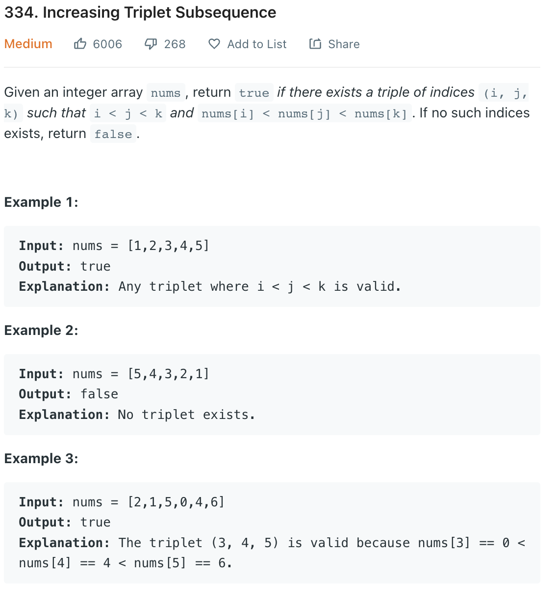

___
[334. Increasing Triplet Subsequence](https://leetcode.com/problems/increasing-triplet-subsequence/)
___


## 基本思路
* This is a greedy question.
* If we find a num that is less that both `firstNum` and `secondNum`, we return True

___

`Time complexity : O(n)`

`Space complexity : O(1)`
```python
class Solution:
    def increasingTriplet(self, nums: List[int]) -> bool:
        first_num = float("inf")
        second_num = float("inf")
        for n in nums:
            if n <= first_num:
                first_num = n
            elif n <= second_num:
                second_num = n
            else:
                return True
        return False
```