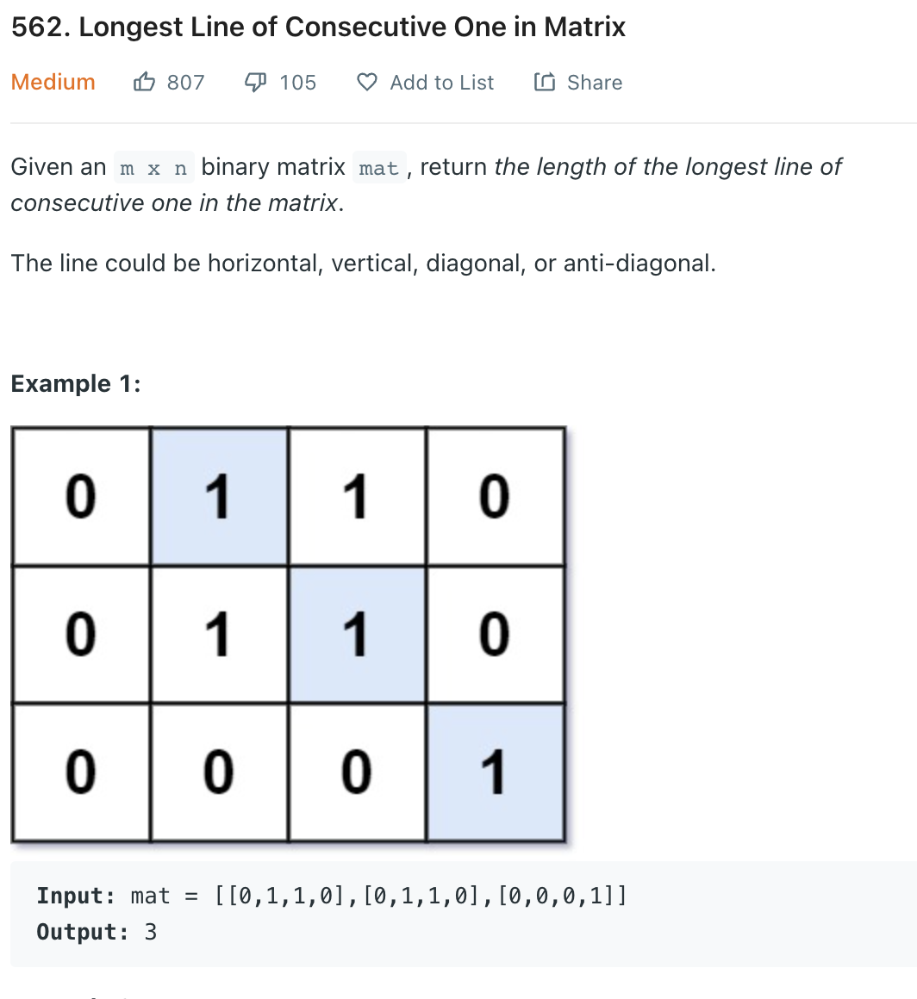

___
[562. Longest Line of Consecutive One in Matrix](https://leetcode.com/problems/longest-line-of-consecutive-one-in-matrix/)
___


## 基本思路
* This is a fair easy Dynamic Programming question.
* We are using 3d Array to store the 状态 of each coordinate
* Each coordinate contains `top left topLeft topRight` 4 status.
* Which represent the current Max Ones on each direction.

___

`Time complexity : O(n^2)`

`Space complexity : O(n^2)`
```python
class Solution:
    def longestLine(self, mat: List[List[int]]) -> int:
        m = len(mat)
        n = len(mat[0])
        answer = 0
        
        dp = [[[0 for _ in range(4)]for _ in range(n)] for _ in range(m)] 
        
        for row in range(m):
            for col in range(n):
                if mat[row][col] == 1:
                    top = left = topLeft = topRight = 1
                    if row > 0:
                        top += dp[row - 1][col][0]
                    if col > 0:
                        left += dp[row][col - 1][1]
                    if row > 0 and col > 0:
                        topLeft += dp[row - 1][col - 1][2]
                    if row > 0 and col < n - 1:
                        topRight += dp[row - 1][col + 1][3]
                    dp[row][col] = [top, left, topLeft, topRight]
                    answer = max(answer, top, left, topLeft, topRight)
                    
        return answer
                        
```